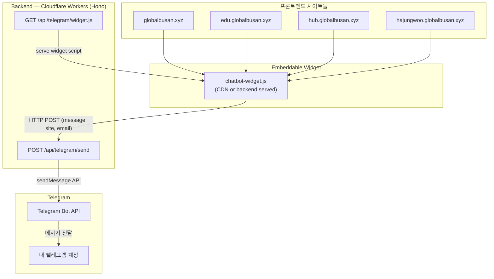
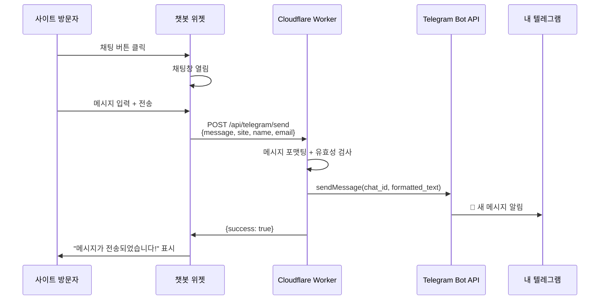

# 🤖 Telegram Chatbot Widget — 아키텍처 설계서

## 1. 시스템 개요

**목표**: 모든 프론트엔드 사이트에 `<script>` 한 줄만 삽입하면 플로팅 챗봇 버튼이 생기고, 사용자 메시지가 내 텔레그램으로 전달되는 구조.

**적용 대상 사이트**:
| 프론트엔드 | 도메인 (예상) |
|---|---|
| `frontend` | globalbusan.xyz |
| `frontend-ai-edu` | edu.globalbusan.xyz |
| `frontend-busan-roadmap` | hub.globalbusan.xyz |
| `frontend-hajungwoo` | hajungwoo.globalbusan.xyz |

---

## 2. 전체 아키텍처



---

## 3. 데이터 플로우



---

## 4. 백엔드 구현 설계

### 4.1 파일 구조 (추가분)

```
backend/src/
├── index.js                    # ← telegramRoutes 추가
├── routes/
│   ├── telegram.js             # ★ NEW — API 라우트
│   └── ... (기존 파일들)
└── modules/
    └── telegram-widget.js      # ★ NEW — 위젯 JS 생성/서빙
```

### 4.2 환경 변수 (Secrets)

```toml
# wrangler.toml에 주석 추가, 실제 값은 wrangler secret으로 설정
# TELEGRAM_BOT_TOKEN    — @BotFather에서 발급
# TELEGRAM_CHAT_ID      — 내 텔레그램 계정의 chat_id
```

### 4.3 API 엔드포인트

| Method | Path | 설명 |
|--------|------|------|
| `POST` | `/api/telegram/send` | 메시지를 텔레그램으로 전송 |
| `GET` | `/api/telegram/widget.js` | 위젯 스크립트 서빙 |

### 4.4 `routes/telegram.js` — 핵심 로직

```js
import { Hono } from 'hono'

const app = new Hono()

// 메시지 전송 API
app.post('/send', async (c) => {
  const { message, name, email, site } = await c.req.json()

  if (!message?.trim()) {
    return c.json({ error: 'Message is required' }, 400)
  }

  const botToken = c.env.TELEGRAM_BOT_TOKEN
  const chatId = c.env.TELEGRAM_CHAT_ID

  if (!botToken || !chatId) {
    return c.json({ error: 'Telegram not configured' }, 500)
  }

  // 메시지 포맷팅 (사이트별 구분 가능)
  const text = [
    `💬 *새 문의 메시지*`,
    `━━━━━━━━━━━━━━━`,
    `📍 사이트: ${site || 'Unknown'}`,
    name ? `👤 이름: ${name}` : null,
    email ? `📧 이메일: ${email}` : null,
    ``,
    `📝 메시지:`,
    message,
    `━━━━━━━━━━━━━━━`,
    `🕐 ${new Date().toLocaleString('ko-KR', { timeZone: 'Asia/Seoul' })}`
  ].filter(Boolean).join('\n')

  const tgResponse = await fetch(
    `https://api.telegram.org/bot${botToken}/sendMessage`,
    {
      method: 'POST',
      headers: { 'Content-Type': 'application/json' },
      body: JSON.stringify({
        chat_id: chatId,
        text,
        parse_mode: 'Markdown'
      })
    }
  )

  if (!tgResponse.ok) {
    console.error('Telegram API error:', await tgResponse.text())
    return c.json({ error: 'Failed to send message' }, 500)
  }

  return c.json({ success: true, message: '메시지가 전송되었습니다.' })
})

// 위젯 스크립트 서빙
app.get('/widget.js', async (c) => {
  const backendUrl = new URL(c.req.url).origin
  const script = generateWidgetScript(backendUrl)

  return new Response(script, {
    headers: {
      'Content-Type': 'application/javascript',
      'Cache-Control': 'public, max-age=3600',
      'Access-Control-Allow-Origin': '*'
    }
  })
})

export default app
```

### 4.5 `index.js` 수정 (최소 변경)

```diff
 // Routes
+import telegramRoutes from './routes/telegram.js'
 
 // API Routes
+app.route('/api/telegram', telegramRoutes)
```

### 4.6 CORS 설정 업데이트

```diff
 app.use('*', cors({
-  origin: ['http://localhost:3000', 'http://localhost:3001'],
+  origin: [
+    'http://localhost:3000',
+    'http://localhost:3001',
+    'https://globalbusan.xyz',
+    'https://edu.globalbusan.xyz',
+    'https://hub.globalbusan.xyz',
+    'https://hajungwoo.globalbusan.xyz'
+  ],
   credentials: true
 }))
```

---

## 5. 위젯 스크립트 설계

### 5.1 사이트 삽입 방법 (한 줄)

```html
<!-- 모든 사이트의 </body> 앞에 추가 -->
<script src="https://api.globalbusan.xyz/api/telegram/widget.js" defer></script>
```

또는 `data-*` 속성으로 커스터마이징:

```html
<script
  src="https://api.globalbusan.xyz/api/telegram/widget.js"
  data-site="hajungwoo.globalbusan.xyz"
  data-color="#6C5CE7"
  data-position="right"
  defer
></script>
```

### 5.2 위젯 기능 명세

| 기능 | 설명 |
|------|------|
| 플로팅 버튼 | 화면 우하단 고정, 펄스 애니메이션 |
| 채팅창 | 이름(선택), 이메일(선택), 메시지(필수) 입력 폼 |
| 전송 피드백 | 성공/실패 토스트 메시지 |
| 다크모드 대응 | `prefers-color-scheme` 자동 감지 |
| 모바일 대응 | 반응형 레이아웃, 터치 최적화 |
| Shadow DOM | 호스트 사이트 CSS와 격리 |

### 5.3 위젯 UI 구조

```
┌─────────────────────┐
│  💬 문의하기         │ ← 헤더 (커스텀 색상)
├─────────────────────┤
│  이름 (선택)         │
│  [________________] │
│  이메일 (선택)       │
│  [________________] │
│  메시지 *            │
│  [________________] │
│  [________________] │
│  [________________] │
│                     │
│  [  📤 전송하기  ]   │ ← CTA 버튼
└─────────────────────┘
         ↑
    ┌─────────┐
    │  💬  🔴  │  ← 플로팅 버튼 (클릭시 토글)
    └─────────┘
```

---

## 6. 텔레그램 봇 설정 가이드

### 6.1 Bot 생성

```
1. 텔레그램에서 @BotFather 검색
2. /newbot 명령어 입력
3. 봇 이름 설정 (예: GlobalBusan Contact Bot)
4. 봇 username 설정 (예: globalbusan_contact_bot)
5. ✅ 발급된 BOT_TOKEN 저장
```

### 6.2 Chat ID 확인

```
1. 봇에게 아무 메시지 전송
2. 브라우저에서 접속:
   https://api.telegram.org/bot<BOT_TOKEN>/getUpdates
3. result[0].message.chat.id 값이 CHAT_ID
```

### 6.3 Cloudflare Workers Secret 등록

```bash
wrangler secret put TELEGRAM_BOT_TOKEN
# → 봇 토큰 입력

wrangler secret put TELEGRAM_CHAT_ID
# → 채팅 ID 입력
```

---

## 7. 보안 고려사항

| 항목 | 대응 방안 |
|------|----------|
| 스팸 방지 | Rate Limiter (기존 `/api/*` 적용됨, 추가로 `/api/telegram/send`에 더 강한 제한 가능) |
| XSS 방지 | 메시지 입력값 sanitize, Telegram Markdown escape |
| CORS | 허용된 origin만 접근 가능 |
| Bot Token 노출 | Cloudflare Secret으로 관리, 프론트엔드 노출 없음 |
| 과도한 요청 | IP 기반 rate limit + 클라이언트 쿨다운 (30초) |

---

## 8. 구현 순서 (체크리스트)

- [ ] **Step 1**: 텔레그램 봇 생성 & BOT_TOKEN, CHAT_ID 확보
- [ ] **Step 2**: `wrangler secret put`으로 시크릿 등록
- [ ] **Step 3**: `backend/src/routes/telegram.js` 생성 (API 라우트)
- [ ] **Step 4**: `backend/src/modules/telegram-widget.js` 생성 (위젯 스크립트 생성기)
- [ ] **Step 5**: `backend/src/index.js` 수정 (라우트 등록 + CORS 업데이트)
- [ ] **Step 6**: `wrangler dev`로 로컬 테스트
- [ ] **Step 7**: `wrangler deploy`로 배포
- [ ] **Step 8**: 각 프론트엔드에 `<script>` 태그 한 줄 추가

---

## 9. 텔레그램 수신 메시지 예시

```
💬 새 문의 메시지
━━━━━━━━━━━━━━━
📍 사이트: hajungwoo.globalbusan.xyz
👤 이름: 김부산
📧 이메일: kim@example.com

📝 메시지:
AI 기반 물류 시스템에 대해 더 알고 싶습니다.
협업 가능한지 문의드립니다.
━━━━━━━━━━━━━━━
🕐 2026. 5. 13. 오후 6:10:00
```

---

> [!IMPORTANT]
> **핵심 포인트**: 프론트엔드 코드 변경 없이 백엔드만으로 완결됩니다.
> 위젯 JS 파일도 백엔드 Worker가 직접 서빙하므로 별도 CDN 불필요.
> 각 사이트에는 `<script src="https://api.globalbusan.xyz/api/telegram/widget.js" defer></script>` 한 줄만 추가하면 됩니다.
