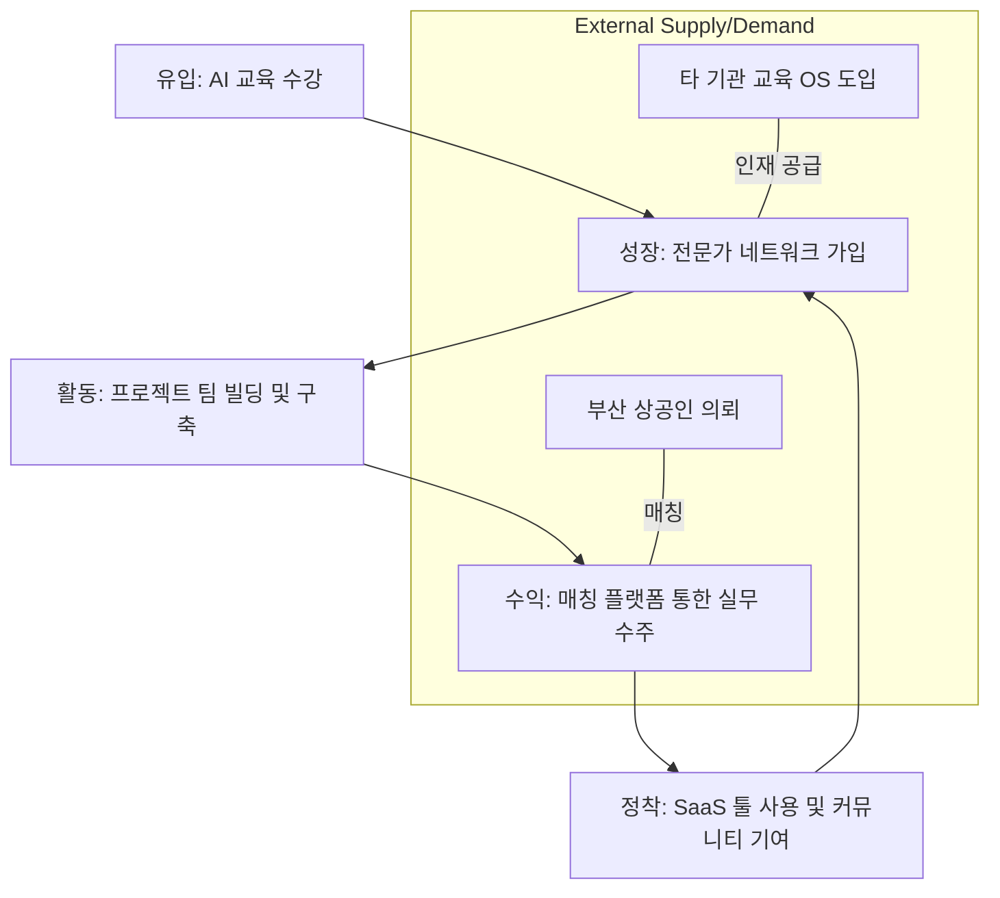

# [Master Plan] 부산 AI 통합 생태계 플랫폼 전략 및 설계 (AI-Hub Busan)

## 1. 개요 및 철학 (Philosophy)

### 학원(Academy)을 넘어 플랫폼(Platform)으로
부산 AI 시장의 초기 진입은 교육으로 시작되지만, 단순한 "학원형 확장"은 강사 관리, 지점 관리 등의 노동집약적 한계에 부딪히게 됩니다. 우리가 추구하는 방향은 **"부산 AI 생태계를 연결하는 플랫폼 운영자"**로서 기술과 사람, 그리고 시장을 하나로 묶는 것입니다.

### 핵심 차별점: AI 실전 커뮤니티
기존의 온라인 강의 플랫폼(클래스101, 인프런 등)과 경쟁하는 것이 아니라, **"AI로 실제 가치를 만드는 사람들"**의 로컬 커뮤니티를 기반으로 실전적인 구축 사례를 만들어내는 것이 우리의 유니크한 경쟁력입니다.

---

## 2. 전략적 포지셔닝 (Strategic Positioning)

### 플랫폼 창업자형 모델
우리의 강점인 AI 변화 감각, 지역 네트워크, 콘텐츠 기획력을 바탕으로 다음과 같은 순환 구조를 지향합니다.

**[ 사람 모임 → 프로젝트 → 협업 → 구축 → 수익화 → 툴/플랫폼 ]**

### 학원 모델 vs 플랫폼 모델 비교
| 구분 | 학원형 모델 (운영 중심) | 플랫폼 모델 (생태계 중심) |
| :--- | :--- | :--- |
| **핵심 가치** | 지식 전달, 수강생 수 | 커뮤니티 활성도, 프로젝트 수 |
| **확장성** | 낮음 (인적 자원 의존) | 매우 높음 (네트워크 효과) |
| **수익 구조** | 일회성 수강료 | 구독료, 수수료, 라이선스 등 다변화 |
| **장기 비전** | 부산 유명 AI 학원 | 부산 AI 경제권 허브 |

---

## 3. 통합 아키텍처: 5대 핵심 영역 (Integrated Design)

본 플랫폼은 유입(Traffic)부터 정착(SaaS)까지의 유기적인 모듈 구성을 통해 선순환 생태계를 구축합니다.

### [Module 1] AI 교육 OS (Education OS)
*   **역할**: 생태계의 유입 관문 및 기술 표준 보급.
*   **기능**: LMS 통합, 실습용 AI 샌드박스 제공, B2B 교육 시스템 라이선스화.

### [Module 2] 부산 AI 전문가 네트워크 (Expert Network)
*   **역할**: 검증된 인재 풀 확보 및 휴먼 네트워킹.
*   **기능**: AI 역량 스코어링 프로필, 직군별 서브 커뮤니티, 지역 밋업 운영.

### [Module 3] AI 프로젝트 플랫폼 (Project Builder)
*   **역할**: 결과물을 만들어내는 협업 엔진.
*   **기능**: AI 기반 팀 빌딩 추천, 마일스톤 시각화, 데모 데이 쇼케이스.

### [Module 4] AI 구축 매칭 플랫폼 (Marketplace)
*   **역할**: 외부 수요(부산 상공인)와 전문가의 수익 연결.
*   **기능**: Smart RFP(요구사항 번역), 에스크로 안전 결제, 포트폴리오 자동 연동.

### [Module 5] AI 커뮤니티 SaaS (Efficiency Tools)
*   **역할**: 생산성 향상 및 유저 락인(Lock-in).
*   **기능**: 프롬프트 라이브러리, 워크플로우 템플릿 공유, 팀 단위 API 지갑 기능.

---

## 4. 비즈니스 프로세스 (User Journey & Model)

### 유저 저니 (Circular Economy)

### 수익 모델 (Monetization Strategy)
*   **안정적 기반**: 교육비 및 교육 OS 라이선스 (B2B)
*   **확장성**: 프로젝트 매칭 수수료 (10~20%)
*   **지속성**: AI 워크플로우 SaaS 구독료 및 API 사용료

---

## 5. 실행 로드맵 및 KPI (Roadmap & KPIs)

### 실행 단계
1.  **Phase 1 (1~4개월)**: 부산 기반 실전 교육 런칭 및 프롬프트 공유 라이브러리 배포.
2.  **Phase 2 (5~8개월)**: 웹 기반 프로젝트 관리 도구 런칭 및 구축 사례(Case Study) 10건 확보.
3.  **Phase 3 (9개월~)**: 에스크로 통합, 영남권 AI 허브 확장 및 SaaS 유료화 전환.

### 핵심 목표 (KPI)
우리는 단순 학생 수가 아닌 **'생태계의 건강성'**을 지표로 삼습니다.
*   ✅ 커뮤니티 활성도 (MAU, 참여율)
*   ✅ 등록된 프로젝트 및 협업 건수
*   ✅ 실무 구축 매칭 성공 사례 수
*   ✅ SaaS 툴 사용률 및 템플릿 공유 수

---

## 6. 결론: "부산 AI 경제권"을 향하여

이 플랫폼은 인프라(SaaS), 인력(Network), 자산(Education), 시장(Marketplace)이 하나로 결합된 거대한 **AI 생산 기지**입니다. 부산 지역 상공인들의 디지털 전환 수요를 AI로 해결하고, 그 수익이 다시 지역 인재의 성장으로 이어지는 강력한 자생적 경제권을 구축하는 것이 우리의 최종 목표입니다.