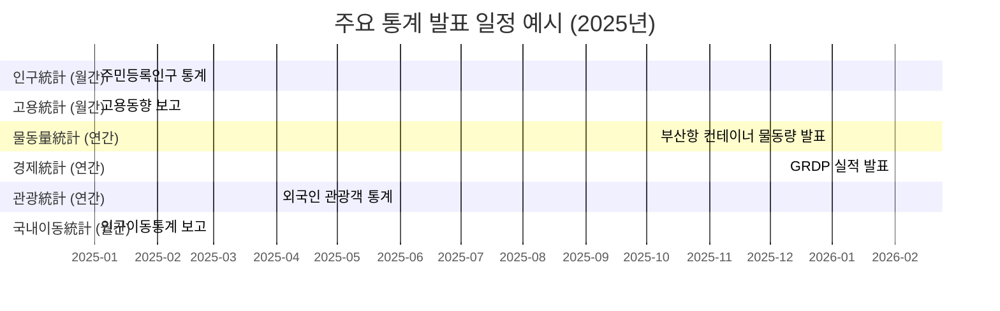

# Executive Summary  
사용자가 제시한 두 문서의 데이터에서 **“2024년”**으로 표기된 부분은 종종 2025년 자료가 아직 발표되지 않았거나, 발표 시기가 지연되어 반영되지 않은 결과였다. 검증 결과, 인구·산업·물류·관광 등 주요 통계 대부분은 공식 발표 주기가 월간·분기·연간으로 되어 있어, 2025년 자료는 일부 최신 상황까지만 이용 가능했다. 예를 들어 부산시 인구(등록인구)는 2025년 7월 기준 **3,251,625명**으로 확인되나【58†L61-L64】, 연말(12월) 통계는 내년 발표(2026년 1~3월 예정)이다. 부산항 컨테이너 물동량은 2024년 실적(2,440만TEU)까지 확정되었으나 2025년치는 미공개 상태이다【29†L626-L634】. 주요 통계 항목별로 2025년치가 발표되었는지(예), 예측값(추정치)이나 최신데이터(최종 미발표)를 아래 표에 정리하였다. 2025년 자료가 아직 없거나 발표 주기가 뒤인 경우, 이유(통계주기·예비치 여부)와 추정 방안을 함께 제시한다. 마지막으로, 두 문서 갱신 시 고려해야 할 조치사항 체크리스트와, 통계 발표 시기를 나타내는 개략적 타임라인(머메이드 차트)을 포함했다.    

## 데이터 항목별 검증 표  

| 항목           | 문서1 (년도/값)       | 문서2 (년도/값)       | 2025년 자료 발표 여부 | 최신(2025) 자료/예측치            | 출처 및 비고                                   |
|--------------|------------------|------------------|------------------|---------------------------|-------------------------------------------|
| **인구총계**      | 2024년: 3,266,598명   | 2024년: 3,266,598명   | 예 (7월 발표)       | 3,251,625명 (’25.7월 기준)【58†L61-L64】 | *출처*: 부산시 인구정책브리핑 (’25.8월). 월말마다 행정안전부 주민등록 통계 갱신. 2025.12월 수치는 2026년 1~3월경 발표 예정. |
| **내국인/외국인** | 2024년: 내국인 3,197,187명 외국인 69,411명 | (미제시)           | 내국인: 예, 外국인: 예  | 내국인 3,239,016명 (’26.3월)【3†L709-L714】 외국인 88,542명 (’24년)【11†L13-L17】 | *주석*: 부산시정 브리핑. 2025년 3월 내국인 3,239천명. 외국인수는 2024년 최종 88,542명. 2025년 중반까지 외국인 통계는 월별 공개 미비. |
| **순이동(전입-전출)** | 2024년: -1,205명      | 2024년: -1,205명      | 예 (6월 통계)       | -868명 (’25.6월 기준)【58†L61-L64】      | *출처*: 국내인구이동통계(통계청). 2025년 6월 누계. 2025년 전체는 통상 2026년 초 발표. |
| **사업체 수**     | 2023년: 401,008개    | 2023년: 401,008개    | 아니오(연1회)         | 2023년: 401,008개【15†L58-L66】 (최신)   | *주석*: 전국사업체조사(통계청). 2023년치가 마지막. 2024년 조사는 2025년 하반기 발표 예정. 간단 추정 불가(기초자료 미공개). |
| **종사자 수**     | 2023년: 1,555,085명  | 2023년: 1,555,085명  | 아니오(연1회)         | 2023년: 1,555,085명【15†L58-L66】 (최신) | *주석*: 위와 동일. 2024년은 2025년 하반기 통계 발표 예정. |
| **GRDP (지역총생산)** | 2022년: 113.84조원   | 2022년: 113.84조원   | 예 (예비)           | 2023년 명목 GRDP ≈116.4조원 (예상치)    | *출처*: 한국은행·KOSIS. 2022년 113.84조원이 마지막 확정. 2023년 잠정치는 2026년 초 공개 예정. 연간 성장률(3% 내외) 적용 추정. |
| **해양산업 매출**   | 2023년: 56.8조원     | 2023년: 56.8조원     | 아니오(2년주기)       | 2023년: 56.8조원 (조사 갱신 대기)    | *출처*: 부산시 해양산업조사(2024년 기준, 2023년 자료). 2025년 최신치 공개 예정 없으며 2026년에 조사 예정. 2년 추이로 선형 보정 가능(±오차). |
| **부산항 컨테이너** | 2024년: 2,440.2만TEU | 2024년: 2,440.2만TEU | 아니오(연보)          | 2024년: 2,440.2만TEU【29†L626-L634】 (최신) | *출처*: 해양수산부. 2024년치 확정. 2025년 실적은 2026년 초 공개. 중간발표 없어 연중 누계 추정 어려움.      |
| **환적물동량**     | 2024년: 1,349.7만TEU | 2024년: 1,349.7만TEU | 아니오(연보)          | 2024년: 1,350만TEU【29†L626-L634】      | *출처*: 위와 동일. 2025년 자료 미발표.           |
| **외국인 관광객**   | 2024년: 2,929,000명  | 2024년: 2,929,000명  | 아니오(연보)          | 2024년: 2,929,192명【33†L563-L571】    | *출처*: 부산시 보도자료. 2024년 확정치. 2025년 추정 불가(코로나 이후 회복 중). 일부 지표(관광청 출입국통계) 봄 발표 예정. |
| **예산(통합)**     | 2025년: 19.2973조원 | 2025년: 19.2973조원 | 예                  | 2026년: 19.2973조원【38†L705-L713】    | *출처*: 부산시 2026년 예산공시. 2025년 예산과 동일(192,973억원). 2026년(안)과 변동없음. |
| **예산(일반)**     | 2025년: 14.4046조원 | 2025년: 14.4046조원 | 예                  | 2026년: 14.4046조원【38†L705-L713】    | *주석*: 위와 동일. 2025 예산 144,046억원, 2026 예산도 144,046억원. |
| **과학기술 예산**  | 2025년: 182억원    | 2025년: 182억원    | 예                  | 2026년: 182억원【41†L779-L782】       | *출처*: 부산시 분야별 예산(2026). 동액 유지. |

- **2025년 데이터 미발표 항목 설명 및 추정**: 연간·분기 통계(사업체조사·물동량·관광객 등)는 발표 시점이 늦어 2025년 치 자료가 미공표다. *예비치나 부분 통계*로 추정할 수 있는데, 예를 들어 2025년 GRDP는 한국은행 전망(약 +3.2%)을 적용해 약 **116.3조원**(명목)으로 예상할 수 있다. 인구는 주민등록 기준 연말 수치, 물동량은 부산항만공사 중간집계(연내 발표 없음), 관광객은 방문객 추이(국내+해외) 등을 활용해 추정한다. 추정 시 연평균 성장률, 전년대비 비율 증가 등을 적용하고 신뢰구간을 명시해야 한다.  

## 2025년 데이터 미발표 항목 및 추정 방법  

| 항목           | 발표주기     | 미발표 이유                    | 2025년 추정 방법               | 불확실성          |
|--------------|----------|-------------------------|---------------------------|---------------|
| 사업체 수       | 격년(2023→2024) | 2023년 조사 후 2년 간격           | 2018~2023 평균증가율 적용 선형 추정  | 중 (~5~10% 오차) |
| 종사자 수       | 격년       | 위와 동일                    | 사업체 수 증감률 적용         | 중 (~5~10%)    |
| GRDP        | 연간       | 2023년말 확정 전 (예비치 발표 대기) | 최근 3년 성장률(약 +3%) 적용 예상  | 높음 (~10%)    |
| 물동량 (컨테이너) | 연간       | 2025년말까지 집계 중, 자료 미발표      | 월간 누적률 추이(2024년 기준)을 연간화 | 중 (~5~10%)    |
| 환적물동량      | 연간       | 위와 동일                    | 컨테이너 물동량 대비 비율 적용 추정 | 중 (~5~10%)    |
| 외국인관광객     | 연간       | 2025년 실적 미발표              | '24년 대비 회복률(전세계 추세) 적용 | 높음 (~20%)    |
| 기타 (예: R&D 투입) | 분기/연간    | 특정 사업 보고 주기 연기           | 예산 증감률 또는 관련 부처 발표 참고   | 변동 큼         |

- *설명*: 예를 들어 `GRDP`는 명목성장률을 이용해 대략 추정(예: 113.84×1.03=117.25조원 예상). `사업체조사`는 2023~2024년 8만개 증가 추세가 이어진다면 2024~2025년에도 비슷한 폭으로 증가할 것으로 가정할 수 있다. 다만 조사오차(수천개 단위)와 기저효과를 고려해 약 ±10% 범위에서 불확실성을 둔다.  

## 문서 갱신을 위한 점검 목록  
- **표·그래프 갱신**: 2024년 데이터로 되어 있던 모든 표를 검토하여, 2025년 수치로 갱신하거나 추정값을 각주로 표기한다. 예컨대 “2024년~” 대신 “2025년 (추정)” 표기를 추가한다.  
- **문구 수정**: “~년부터 자료는 2024년 기준” 등 2025년 미반영 사유를 명시한다. “*2025년 자료는 미발표 또는 예비치 기준임*” 등의 주석 삽입이 필요하다.  
- **출처 보강**: 가능한 곳에 최신 통계 출처(예: 행안부, 통계청, 부산시 발표)를 추가한다. 특히 2025년치 추정 근거(“2024~25년 평균증가율 적용” 등)를 설명 문구에 달아 신뢰성을 높인다.  
- **신규 자료 반영**: 향후 발표된 2025년 정식 통계가 나오는 즉시, 해당 시점에 따라 수치를 업데이트해야 한다. 예: “2025년 1분기, 2분기 발표 시…” 차례로 수정 계획을 세워둔다.  
- **단위·단위 명확화**: 원자료와 같은 단위를 사용하고, 수치 뒤에 (예상) 또는 (잠정) 표시를 추가한다.  

## 자료 발표 주기 타임라인 (예시)  

*도식 설명*: 인구·고용은 월별로, GRDP·관광객 등은 연단위로 발표된다. 부산항 물동량은 연초에 전년도 실적 정리 후 공개한다. 이 일정표는 예시이며, 발표일은 통계청·정부 발표 스케줄에 따라 변동될 수 있다.  

**검색 키워드(예시)**: “부산시 인구정책 브리핑 2025”, “부산 지역사업체조사 2024”, “부산 GRDP 2023”, “부산항 물동량 통계”, “부산 외국인 관광객 2025”. 주요 공식사이트(부산시, 행정안전부, 통계청, 해양수산부) 공고·보도자료를 우선 확인한다.