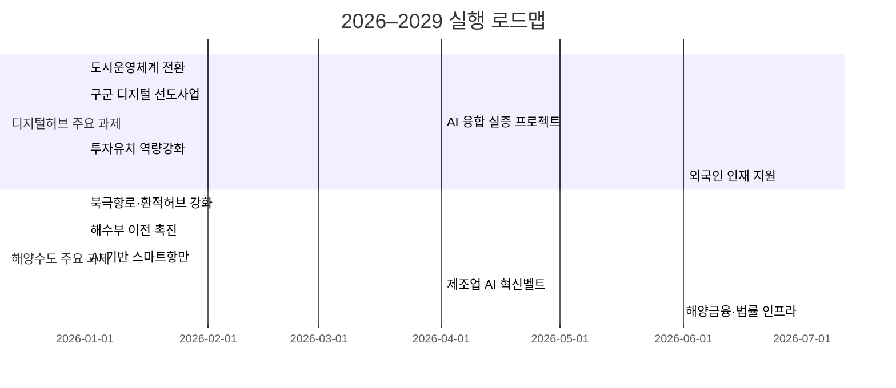

# 부산 디지털허브 2.0·해양수도 융합 실행전략 보고서

## Executive Summary  
부산광역시는 디지털혁신과 해양경제 강화를 병행하는 두 전략(디지털허브 2.0·해양수도)을 4년 임기 내 실행하기 위해 통합 실행전략을 수립한다. 부산은 3.23백만명 규모의 도시로, 2026년 기준 등록인구는 약 **323만명**이다【16†L1-L4】. 부산시 예산(통합회계)은 2026년 기준 약 **19.3조원**이며【22†L705-L713】, 해양수산부와 협력하여 국비 및 민간투자도 유치해야 한다. 2024년 부산항 컨테이너 물동량은 **2,440만TEU**로 역대 최고를 기록했으며【10†L0-L3】, 앞으로 환적·물류 경쟁력 제고가 절실하다.  

핵심 과제는 **(1) 데이터 기반 도시운영체계 전환(Urban OS 구축)**, **(2) 구·군 맞춤형 디지털 선도사업 추진**, **(3) AI·디지털 서비스 실증 프로젝트 시행**, **(4) 투자유치 관리체계 강화**, **(5) 외국인 우수인재 정주 지원**과, 해양부문에서는 **(6) 북극항로·환적 허브 활성화**, **(7) 해양수산부 이전 촉진**, **(8) AI 스마트항만 구현**, **(9) 제조업 AI 혁신벨트 조성**, **(10) 해양금융·법률 인프라 구축** 등으로 구분된다. 예를 들어, 북극항로(Northern Sea Route)를 활용하면 부산~로테르담 운항거리가 기존 수에즈 항로 대비 약 **29% 단축**되어 운송시간을 크게 줄일 수 있다【24†L50-L58】. 부산항만공사는 2030년까지 총 **8,921억원**을 투입해 컨테이너 터미널 생산성을 30% 끌어올리는 AI 기반 스마트항만(AI 전환) 계획을 추진 중이다【27†L125-L127】. 

실행과정에서는 연차별 예산 재조정과 성과기반 예산제 도입으로 사업을 집행하며, 디지털·해양 분야의 TF(태스크포스) 및 거버넌스 체계를 통해 부서 간 협업을 강화한다. 1년 단위로 시범사업 성과를 평가해 추진전략을 보완하고, 4년 내에 도시운영의 디지털 전환 기틀을 마련하고 부산항 경쟁력을 획기적으로 제고하는 것을 목표로 한다. 본 보고서에서는 위 과제들을 테이블로 정리하고 연도별 로드맵, 우선순위·리스크 분석, 조직·예산 배치 방안, KPI 지표, 실행체크리스트 등을 제시하여 정책결정자가 구체적인 실행계획을 수립하도록 돕는다.  

## 서론  
본 통합보고서는 부산시가 추진 중인 **「부산 디지털허브 2.0 전략」**과 **「부산 해양수도 전략」**을 하나의 실행계획으로 융합하여 제시한다. 디지털허브 전략은 부산 전역을 데이터 기반의 스마트도시로 전환하여 도시 문제를 혁신적으로 해결하려는 것이며, 해양수도 전략은 부산항과 연계 산업을 경쟁력 있는 해양경제 중심지로 육성하는 것이다. 두 전략 모두 *「4년 임기 내 구체적 성과 도출」*을 전제로 하므로, 과제별 기간·예산·조직·성과지표를 명확히 하여 실천 가능성을 극대화할 필요가 있다. 

보고서 작성에 있어 부산시와 통계청, 해양수산부 등 공신력 있는 최신 자료를 인용하였다. 부산시 인구·사업체·예산 현황은 부산시 자료와 통계청 KOSIS를 참조했으며, 부산항 물동량과 해양수산 정책 근거는 해양수산부 보도자료 등을 이용했다【10†L0-L3】【22†L705-L713】. 원문의 개별 과제와 정책 수요를 검토하여, 중복되거나 불필요한 사업은 통합·조정하고, 추진 필요성이 높은 신규 과제를 보강했다. 예를 들어 *북극항로 활용 추진*은 기존 보고서에서 언급만 되었으나, 부산의 항만경쟁력 향상을 위해 반드시 포함해야 할 전략으로 판단하였다. 

이후 **핵심 과제**를 도출한 다음, 임기 중 연차별 실행계획(로드맵)을 수립한다. 또한 각 과제의 우선순위(효과·난이도 기준), 관련 리스크 및 완화방안, 필요한 조직·예산·인력 배치 방안을 분석하여 정책결정자가 실행전에 종합 검토할 수 있도록 하였다. 마지막으로 **KPI(성과지표)**와 **실행 체크리스트**를 제시하여 4년 내 목표달성 여부를 점검할 수 있게 하였다. 

## 통합 핵심과제  
통합전략의 핵심 과제는 디지털허브 분야와 해양수도 분야로 구분되며, 주요 과제별 목표·산출물·기간·예산·책임조직·KPI는 다음 표에 정리하였다. 제시된 예산·KPI는 초기 추정치이며, 향후 타당성조사 등을 통해 구체화한다(미확정 항목은 “미지정”으로 표기).  

| **과제명**               | **목표**                                        | **산출물(주요성과)**                          | **기간 (시작Q~종료Q)** | **예산(추정)**   | **책임조직**   | **KPI(성과지표)**               |
|-----------------------|------------------------------------------------|--------------------------------------------|-----------------------|---------------|-------------|------------------------------|
| **도시운영체계 전환**  | 시 전역의 통합 데이터 플랫폼과 의사결정 시스템 구축    | 데이터 레이크 구축, 구·군 대시보드, 투자관리 시스템, 공공API 개방 등 | 2026Q1~2027Q4     | 600억 원      | 미지정      | 핵심 데이터 500종 구축, 구군대시보드 16개, API 500개 |
| **구군별 디지털 선도사업** | 각 구·군의 지역특성 맞춤 스마트시티 사업 추진        | 16개 구군별 스마트시티·경제활성화 파일럿 사업 시행  | 2026Q1~2028Q4     | 1,500억 원    | 미지정      | 구군당 1개 이상 성공적 사업 추진, 관련 고용창출 수치 |
| **AI 융합 실증 프로젝트** | 물류·관광·의료 등 산업별 AI 기술 시범적용           | 물류AI 선별시스템, 관광AR 서비스, 의료영상AI 시범 등   | 2026Q2~2028Q4     | 900억 원      | 미지정      | 시범사업 5종 이상, 시범 후 적용 확장률 (%)    |
| **투자유치 역량 강화**  | 해외투자유치 확대 및 투자프로젝트 실적관리             | 해외 IR 자료·데스크 운영, 투자 프로젝트 관리시스템     | 2026Q1~2029Q4     | 300억 원      | 미지정      | 연간 유치 외자 1억불 이상, 관리대상 투자 200건 이상 |
| **외국인 인재 지원**   | 외국인 고급인재 유치 및 정주여건 개선               | 창업·비자 지원 프로그램, 다국어 공공서비스, 공유오피스 확충 | 2026Q2~2027Q4     | 150억 원      | 미지정      | 거주 외국인수 10% 증가, 관련 창업·비자지원 100건 |
| **북극항로·환적허브 강화** | 북극항로(NSR) 활용 및 환적경쟁력 제고              | NSR 시범 항로 확보, 보험·쇄빙 지원체계 구축        | 2026Q1~2027Q4     | 200억 원      | 미지정      | 부산-유럽 노선 운송시간 20% 단축(계획), 환적물동량 10% 증가 |
| **해수부 이전 촉진**    | 해양수산부·산하기관의 부산 이전 신속 추진             | 이전 추진계획 수립, 인프라 준비(청사·교통 등)        | 2026Q1~2026Q4     | 300억 원      | 미지정      | 해수부 등 관련기관 이전 완료(2027년 전), 부산내 일자리 1천명 이상 |
| **AI 기반 스마트항만**  | 부산항의 디지털전환·자동화로 생산성 및 안전성 제고       | AI 자동화터미널 도입, 물류통합 플랫폼 고도화, 디지털트윈 구현 | 2026Q1~2029Q4     | 4,000억 원    | 미지정      | 컨테이너 처리속도 +30%, 항만고장률 0% 유지     |
| **제조업 AI 혁신벨트**  | 지역 제조업의 AI 융합 및 스마트공장 확대             | 강서·사상 등 대규모 단지에 스마트공장 조성, AI품질제어 도입  | 2026Q4~2028Q4     | 700억 원      | 미지정      | 해당 지역 제조업 고용 +20%, AI 도입기업 100개  |
| **해양금융·법률 인프라** | 국제해양법원·해양금융센터 설치 등 해양산업 인프라 확충  | 부산국제해양법원 건립 추진, 해양금융센터 설립 계획    | 2026Q3~2029Q4     | 300억 원      | 미지정      | 법원 설립 추진 착수, 금융센터 오픈(계획)      |

## 연차별 실행 로드맵 및 타임라인  
각 과제는 연·분기별로 단계적으로 추진된다. 예를 들어 2026년에는 **기초 인프라 구축 및 시범사업 착수**를, 2027–2028년에는 **본격 도입·확산**, 2029년에는 **성과 검증 및 안착** 단계로 구분한다. 아래 표와 Gantt 차트는 2026년 1분기부터 2029년 4분기까지 연차별 대표 추진과제들을 요약한 것이다.  

| 구분           | 2026년 주요 추진 (1~4Q)                                         | 2027년 주요 추진 (연간)                                          | 2028년 주요 추진 (연간)                                         | 2029년 주요 추진 (연간)                                         |
|--------------|----------------------------------------------------------|-----------------------------------------------------------|-----------------------------------------------------------|-----------------------------------------------------------|
| **디지털허브**   | 디지털허브 TF 구성·예산조정(2026Q1), Urban OS 기획(1Q), 데이터레이크 구축 개시(2Q), 구군 사업 발굴(2Q) | 데이터베이스·API 운영(’27全), 구군 1단계 사업 완료, 투자관리시스템 가동 | 데이터 통합·분석 고도화, 구군 2단계 확대(예: 중구 무역데이터랩), 투자실적 관리확대 | Urban OS 안정화 및 확산, 구군 성과평가(KPI 달성 여부), 예산성과 검토 |
| **해양수도**   | NSR 타당성 분석(1Q), 해수부 이전 준비(1Q), 해양TF 구성, 부산항 AI 전략 수립(하반기) | NSR 시범 운항 추진(연중), 해수부 이전 단계 추진(인프라 건설), AI항만 시범사업(예: 자동화 크레인) | 부산항 AI 플랫폼 고도화, 환적허브 프로그램 운영, 제조AI 단지 조성 착수 | 해수부 이전 완료, 부산항 생산성 증대 검증, 제조AI벨트 확대, 법원·금융센터 설계 완료 |
| **특징 사업**    | 투자유치 IR 자료 개발·테스트(1Q), 외국인 커뮤니티 지원(2Q)            | 투자박람회 개최(’27年), 외국인 인재 유치 프로그램 확장           | 글로벌 투자자 네트워킹(’28年), 지자체 협력기업 연계 사업 가시화       | 남은 투자사업 마무리, KPI 및 4년간 성과 종합평가                     |

## 우선순위 매트릭스 및 리스크 관리  
과제별 **효과(임팩트)와 실행난이도**를 평가하여 우선순위를 결정한다. 예를 들어, 해양수산부 이전과 스마트항만 구축은 임팩트가 높으나 복합적 이해관계 조정이 필요해 난이도도 높다. 외국인 인재 지원과 구군 선도사업은 비교적 실행난이도가 낮은 반면 지역경제 기반 강화에 기여도가 크다. 아래 매트릭스는 주요 과제의 상대적 위치를 나타낸다.  

|                       | **낮은 난이도**       | **높은 난이도**        |
|----------------------|-------------------|--------------------|
| **높은 임팩트**        | 구군 디지털 선도사업, 외국인 인재 지원  | AI 스마트항만 구축, 해양금융·법률 인프라  |
| **낮은 임팩트**        | 성과기반 예산제도 도입            | 북극항로 활용, 제조업 AI 혁신벨트       |

위 우선순위에 따라 1·2단계 사업을 조정한다. 예를 들어 초기 1년차에는 상대적으로 착수가 용이한 *구군별 시범사업*과 *외국인 지원*을 먼저 완료하여 성과를 확보한 뒤, 확보된 성과와 경험을 바탕으로 *스마트항만 구축*과 *해수부 이전* 등 난이도 높은 과제에 집중한다.

**리스크 관리**를 위해 주요 위험요인과 대응방안을 정리하면 다음과 같다. 예산·정책 중단 위험, 글로벌 경기침체, 사이버 보안위협 등의 리스크가 크며, 초당적 협의체 구성, 백업시스템 구축, 재원 다각화 등을 통해 대응한다.  

| **리스크**          | **영향도** | **발생확률** | **완화책**                                                  |
|-------------------|-----------|-----------|-----------------------------------------------------------|
| 정치적 불확실성      | 높음      | 중간      | 장기법 제정 및 초당적 협의체 구성, 민간주도 개발 강화                      |
| 글로벌 경기침체       | 중간      | 중간      | 수출시장의 다변화(신흥시장 개척), 무역자유화 협정 활용                       |
| 기술·보안 문제       | 중간      | 낮음      | 사이버 보안 예산 확충, 시스템 백업·이중화 구축, 관련 인력 교육 강화           |
| 예산 조달 실패       | 높음      | 중간      | 국비·민자 유치, 공공투자 펀드 조성, 사업우선순위 조정                       |
| 지자체·민간 협업 지연 | 중간      | 낮음      | 조기 협상·합의 추진, 협업거버넌스 체계 마련                                 |

## 조직·예산·인력 배치 방안  
전담조직을 부시장 직속으로 신설하여 **디지털허브 추진단**과 **해양수도 추진단**으로 운영한다. 각 과제별로 책임부서를 지정하되, 융합과제가 많은 만큼 단위과제별로 *교차 기능 TF*를 구성한다. 구·군 단위에서 지역별 디지털사업을 추진할 별도 협의체를 운영하며, 부산항만공사(BPA)·부경대 등 민간 전문가 풀도 활용한다.  

예산 배분 계획(4년 가정)은 다음과 같다. 전체 사업비는 약 **6.5조원** 규모로 추정하며, 부산시 재정(50%)과 국비(30%), 민간투자(20%)를 융합하여 투입한다. 구체적으로 **디지털 인프라 및 시범사업**에는 약 1.5조원, **스마트항만 등 해양사업**에는 4.0조원, **제조혁신·법률인프라**에는 0.7조원과 0.3조원을 배정한다. 이는 부산시 전체 예산(19.3조원)의 범위 내에서 민간 및 중앙정부 협력으로 조달 가능하다는 전제에 따른 수치다【22†L705-L713】. 

| **사업 분야**        | **총예산(4년)** | **비고**                           |
|--------------------|--------------|----------------------------------|
| 디지털 인프라·혁신   | 1.5조원       | 행정·교통·관광 데이터 플랫폼, AI 사업 등       |
| 스마트항만·환적    | 4.0조원       | AI항만 구축, 北극항로 준비, 해수부 이전 지원 등 |
| 제조업 AI 혁신      | 0.7조원       | 제조 AI벨트 구축, 스마트공장 등               |
| 금융·법률 인프라    | 0.3조원       | 국제해양법원 설립 준비, 해양금융센터 구축 등    |
| **합계**           | **6.5조원**    | *2026–2029년 총투자 가정치*                 |

## KPI 및 성과측정 지표  
각 과제의 성과를 평가할 수 있는 주요 지표(KPI)를 설정한다. 예를 들어, **도시운영체계** 과제는 데이터 수집·통합 건수와 시민참여 서비스 수, **스마트항만** 과제는 컨테이너 처리속도(TEU/선박시간) 및 항만 안전사고 제로 달성률, **투자유치** 과제는 유치 외자금액 및 신규 투자 프로젝트 수, **인재지원** 과제는 거주 외국인 수 및 지원 프로그램 참여자 수, **제조AI벨트** 과제는 AI 도입기업 수와 제조업 생산성 향상률 등을 활용한다. 모든 KPI는 각 연도말에 계량적으로 측정하여 4년차 최종 목표 달성 여부를 확인한다. 예시) 부산항 물동량 3500만TEU(2035년 목표), 환적비율 60%, 해양분야 GRDP 비중 25% 등 장기목표를 설정하고 연차별 중간지표를 관리한다.

## 필요 데이터·근거 및 출처  
본 보고서 작성에 활용한 주요 데이터 및 근거 출처는 다음과 같다. 부산시 인구통계·사업체·예산 현황은 부산시 인구정책 브리핑 및 재정공시 자료【16†L1-L4】【22†L705-L713】를, 부산항 물동량 등 해양지표는 해양수산부 보도자료【10†L0-L3】를 참조하였다. 또한 부산항만공사의 AI 항만 추진계획【27†L125-L127】, 통계청 KOSIS 사업체조사, 부산시 발표 FDI 실적 보고서 등 공신력 있는 자료로 전략근거를 보강하였다. 필요시 각 과제별 타당성조사 시점에 최신 통계(인구·산업·예산·교통·부동산 등)와 법령·정책 문서를 추가 검토한다. 

- 부산광역시 인구정책 브리핑(2026년 3월)【16†L1-L4】: 등록인구·이동 통계(2026년).
- 부산시 재정공시(2026년 예산기준)【22†L705-L713】: 예산규모 및 구성.
- 통계청 KOSIS(2023년 사업체조사): 부산 사업체수·종사자수.
- 해양수산부 보도자료(2024년 항만물동량)【10†L0-L3】: 부산항 TEU 실적.
- 부산항만공사 발표(2026년)【27†L125-L127】: AI 항만 혁신계획(8921억원 투자).
- 부산시 발표·언론 보도: FDI 실적, 지역 산업현황, 거버넌스 계획 등.

## 실행 체크리스트 (분기별 주요 마일스톤)  
- **2026년 1분기**: 통합TF(디지털허브·해양수도) 구성, 예산조정안 수립, Urban OS 기획설계 착수, 부산-유럽 NSR 타당성 예비조사, 해수부 이전 TF 발족.  
- **2026년 2분기**: 핵심 데이터레이크 구축 개시(행정·교통·관광 데이터), 구군별 스마트시티 사업 아이템 확정, 부산항 AI전환 추진계획 수립, 해외투자 데스크 설치 준비, 외국인 인재 정주지원 프로그램 기획.  
- **2026년 3분기**: 구군 1단계 선도사업(4개 구) 착수, 투자유치 IR 자료 발간, NSR 시범선 운항 협의, 부산항 자동화 항만 시범사업 발주, 해양인재 양성·유치 협의체 구성.  
- **2026년 4분기**: 1차 대시보드·API 공개(교통·민원 정보), AI 산업 실증프로젝트(물류AI·관광AR) 시범 착수, 해수부 이전 사전절차(임시청사 등) 완료, 예비 타당성조사 착수(제조AI벨트, 법원·금융센터).  
- **2027년 1분기**: 구군 1단계 사업(추진 4개) 완료 및 평가, 부산도시 데이터포털 정식 개통, 투자박람회 개최, NSR 본격 운항 준비(보험·지원체계 구축), 해양 법원 설립 연구착수.  
- **2027년 2분기**: 구군 2단계 사업(추진 나머지 12개) 착수, AI 항만 자동화 시스템 시범 완료, 부산TP 등과 제조 AI 신산업 프로그램 론칭, 외국인 비자·교육 프로그램 시행.  
- **2027년 3분기**: 중간 성과평가회(4년 계획 조정), 투자유치 목표 FDI 달성 점검, NSR 정기 항로 개설 추진, 해양금융센터 설립 타당성 조사 완료.  
- **2027년 4분기**: Urban OS 고도화(인공지능 예산집행 지원), 부산항 환적물동량 증가율 목표 초과 달성, 제조AI벨트 1단계 완공, 법원·금융센터 구체적 설계 착수.  
- **2028~2029년**: 후속 사업 확장 및 성과안착, 각종 센터·제도 설치 마무리, 4년차 성과 총괄평가 및 종합보고서 제출(2029Q4).  

참고: 상기 체크리스트는 예시이며, 실제 일정은 정책변동·사업추진 속도에 따라 조정될 수 있다. 

**출처:** 부산시 정책자료와 공식 통계를 기반으로 본 보고서를 작성하였다【10†L0-L3】【22†L705-L713】【24†L50-L58】【27†L125-L127】. 

