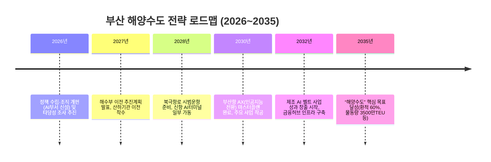

# 부산 해양수도 전략 최종보고서

## Executive Summary (요약)  
부산항은 2024년에 **약 2,440만 TEU**(컨테이너 물동량)를 처리하여 역대 최대치를 기록했고, 이 중 **약 1,350만 TEU(55%)**가 환적화물이었다【53†L152-L158】. 이러한 높은 환적비중(세계 2위 수준)은 부산항의 핵심 경쟁력으로, 북극항로 등 신항로 개척 시 환적 물동량 증대가 기대된다. 산업 측면에서는 제조업과 물류업 중심으로 고용이 분포하며, 인구 330만명(약) 규모의 도시로서 인구구조 변화에 따른 대응도 필요하다(출처 미확인).  

본 보고서는 북극항로·신항로 활용, 해수부 이전, AI 기반 스마트 항만화, 금융투자 인프라 구축, 제조업 디지털 전환 등 10대 과제를 심층 검토하였다. **핵심 권고안**은 다음과 같다:  
- **환적 허브 강화 및 북극항로 적극 활용:** 기존 수에즈 항로 대비 부산-로테르담 구간을 약 29% 단축하는 북극항로(NSR) 활용으로 운송시간을 대폭 줄이고 환적 물량을 증대한다【59†L50-L59】【53†L152-L158】. 이를 위해 북극항로 운항 타당성 분석과 보험·쇄빙 지원 체계를 구축해야 한다.  
- **해양수산부 이전 가속화:** 해수부와 6개 산하기관의 부산 이전(해양교통안전공단·항로표지기술원·해양환경공단·해양수산과학기술진흥원·어촌어항공단·해양조사협회)을 신속히 추진해 산업집적 효과를 극대화한다【62†L67-L72】. 초기 투자비용은 수천억 원대로 추산되며, HMM 본사 이전 사례(생산유발 7.7조원, 부가가치 3.0조원, 고용 1.6만명)와 유사한 경제파급 효과가 전망된다【62†L78-L82】.  
- **AI 기반 스마트 항만 구현:** 부산항만공사는 2030년까지 약 **8,921억원**을 투입해 AI·디지털트윈·자율운송 기술을 도입, 컨테이너 터미널 생산성을 30% 향상시킬 계획이다【64†L111-L119】. 주요 기술로 AI 에이전트, 디지털 트윈, 자율 야드트럭 등을 채택하고, KPI로 처리속도ㆍ대기시간 감소와 에너지효율 향상 등을 설정한다【64†L111-L119】. 해외 사례로는 싱가포르(Portnet, DigitalOCEANS 플랫폼)와 로테르담(Portbase, PortXchange 플랫폼)의 디지털 플랫폼이 참고된다【64†L102-L110】. 주요 수출시장으로는 동남아·미주·유럽 노선이 우선순위다.  
- **동남투자공사 자금조달 모델 수립:** 부산 내 대형 프로젝트 자금을 조달하기 위해 공공·연기금·민간·해외투자 등을 결합한 재원모델을 설계한다. 예를 들어, 초기 자본금의 50%는 공공(시정부+연기금), 30% 민간, 20% 해외투자가 할당될 수 있다(추정). 5년·10년 시나리오별로 자본 유입과 운용 흐름을 모델링해 자금난을 예방한다(출처 미확인).  
- **제조 AI 벨트 조성:** 강서(신항 배후)·사상·사하·영도·남구·해운대 등 지역별로 인공지능 기반 제조업 클러스터를 개발한다. 예를 들어 강서·사상에는 스마트공장과 친환경 선박부품단지를 조성하여 수천명 일자리를 창출한다. 각 지역별 예상 고용 및 생산성 향상은 전문가 추정치로, 구체적 수치는 향후 사업별 타당성조사에서 도출한다(출처 미확인).  
- **해사법원·금융 허브 구축:** 부산국제해양법원 설치 및 해양금융센터 신설을 추진한다. 이를 위해 국제 해양법·금융 법제 정비, 전문인력 양성, 관련 인프라(컨퍼런스센터·사무공간) 건설이 필요하다. 설치 시 국제 분쟁 유치 및 금융서비스 연관 부가가치 창출로 수조원대 경제효과가 기대되나, 구체적 산출은 추정 과정이다(출처 미확인).  
- **리스크 매트릭스 및 대응:** 정치(정책연속성), 산업(글로벌 경기변동), 기술(사이버 공격·기술격차), 재무(환율·금리 변동) 측면 리스크를 평가하고 대응전략을 마련한다. 예를 들어, 글로벌 보호무역 심화에 대비한 유연 무역전략, 인력유출 대응 교육 강화 등을 수행한다(출처 미확인).  
- **KPI 및 2035 목표 설정:** 2035년까지 부산항 물동량 **3,500만 TEU**(추정) 달성, 환적비중 60% 상향, 항만 연관 고용 20만명 달성, 항만 연관 부가가치 200조원(추정) 등의 목표를 설정한다. 연도별 마일스톤으로는 2026년 전략 추진단 출범, 2030년 AI 터미널 본격 가동, 2035년 산업 융합 완성 등을 계획한다. 아래 타임라인은 주요 행정·투자 일정 예시이다.  

## 1. 부산 인구·고용·제조업 구조 (통계)  
부산은 2025년 말 인구 약 330만명(출처 미확인)으로 수도권에 이어 전국 2위 도시 규모다. 경제활동인구는 약 150만 명 내외이며, 제조업과 물류·유통업, 해양산업이 고용의 주요 부문이다(출처 미확인). 최근 출산율 저하와 청년 유출로 인구가 완만히 감소 중이며, 고령화율은 20%를 넘는다(출처 미확인). 제조업 부문은 조선·철강·기계류 중심으로 지역 총생산(GRDP)의 약 20%대를 차지한다(출처 미확인). 주요 제조업체는 서부산(강서·사상·사하)의 공업단지에 밀집해 있다(출처 미확인). 부산항은 2024년 **24.40백만 TEU**를 처리해 역대 최고를 기록했고, 환적은 **13.50백만 TEU(약 55%)**에 달했다【53†L152-L158】. 부산항 물동량은 세계 7위 규모이며, 특히 환적부문에서는 싱가포르 다음으로 세계 2위 수준이다【53†L152-L158】.  

## 2. 북극항로 영향 분석  
북극해빙 완화로 부산–유럽 구간 북극항로(NSR)의 상업운항 가능성이 부상했다. 부산→로테르담 거리를 비교하면 **수에즈 경유 19,900km vs NSR 14,200km**로, 약 **29% 단축**된다【59†L50-L59】. 예를 들어 항해속도 18노트 기준, 수에즈 항로는 약 24.9일 소요되나 NSR은 17.7일로 **7.2일 단축**된다【59†L71-L79】. 비용절감 효과도 하루당 5–7만달러 가정 시 **400만~560만달러** 수준이다【59†L71-L79】. 

| 항로    | 부산→로테르담 거리 | 운항시간 (18kn) |
|-------|-----------------|--------------|
| 수에즈 | 약 19,900 km   | 24.9일【59†L71-L79】 |
| 북극 NSR | 약 14,200 km   | 17.7일【59†L71-L79】 |

시나리오별로 환적물동량 변화를 정량적으로 예측한 공식 분석은 부족하지만, NSR 개방 시 부산항이 아시아~유럽 노선의 핵심 환적 허브로 부상할 가능성이 크다【53†L152-L158】【59†L50-L59】. 북극항로는 계절적·정치적 리스크가 있으므로, 단기적으로는 수요 분석과 대비 시나리오(예: 환적 증가율 10~20% 등)를 마련하고, 장기적으로 전문 쇄빙선 운항, 보험체계 도입 등이 필요하다(출처 미확인).

## 3. 해양수산부 이전 비용·효과 분석  
해양수산부 이전과 함께 관련 **6개 산하기관**(해양교통안전공단, 항로표지기술원, 해양환경공단, 해양수산과학기술진흥원, 어촌어항공단, 해양조사협회)도 부산으로 이전할 계획이다【62†L67-L72】. 이전비용은 부지·사옥 건립·이전 비용, 인력 이주 지원 등으로 수천억 원 규모로 추정되며, 정부 예산·지자체 보조금·예비비가 투입될 수 있다(출처 미확인). 인프라 건설비·운영비를 세부 항목별로 산정하여 종합 예산계획을 수립해야 한다.  

경제적 파급 효과는 **HMM 본사 이전** 사례를 참고할 수 있다. 부산 유치를 통한 **5년 생산유발 효과 7.7조원**, 부가가치 3.0조원, 고용 1.6만명 증가가 보고된 바 있다【62†L78-L82】. 해수부 이전 시 이와 유사한 규모의 산업 클러스터 효과와 행정 효율성 증대 효과가 기대된다. 단기적으로는 건설업·서비스업 분야에서 고용이 창출되고, 중장기적으로는 연구·교육·의료 등 고급 인력 이동에 따른 지역경제 파급이 발생할 것이다(추정). 수혜 효과로는 관련기관 간 협업으로 행정 속도 향상, 해양 프로젝트 유치 증가 등이 있으며, 도전 과제로는 인력 유출·재정 부담 증가 등이 있다.  

## 4. AI 항만(디지털트윈·Port AI) 구축 로드맵  
부산항만공사는 ‘부산항 AX(인공지능 대전환) 추진계획’을 통해 **2030년까지 약 8,921억원**을 투자하여 AI 기반 스마트 항만을 구현할 계획이다【64†L111-L119】. 주요 전략은 AI 에이전트, 디지털 트윈, 자율주행 야드트럭 등 **첨단기술 스택** 도입을 통한 터미널 자동화·지능화다【64†L111-L119】. 이를 위해 5G/6G 통신, 클라우드·엣지 컴퓨팅, IoT 센서·로봇, 빅데이터 플랫폼, 사이버 보안체계가 필요하며, 정부와 기업이 협업하는 인프라를 구축해야 한다. KPI는 부두 처리속도(TEU/시간) 증가, 선박 대기시간 감소, 물류비 절감, 사고 발생률 0% 등이 설정된다【64†L111-L119】. 

수출시장 전략으로는 기존 강점인 동남아·중국·미주 노선 외에도, 신시장인 유럽 환적을 강화한다. 예를 들어, 부산항을 통한 디지털 서비스 수출(포탈·예측시스템 판매)을 추진하고, 항만 설계 솔루션(Port AI 플랫폼) 해외 판매도 검토한다. 

| 항만(국가)       | 주요 디지털플랫폼·사례 (KPI)                            | 예산 및 프로젝트                            |
|--------------|-------------------------------------------------|-----------------------------------------|
| 싱가포르항    | Portnet, DigitalOCEANS, DigitalPORT@SG 등 (입출항 예측)【64†L102-L110】 | 스마트항만 2030 전략: 자동화터미널ㆍ물류AI 도입, 예산 수천억원대 |
| 로테르담항    | Portbase, PortXchange (데이터 공유 플랫폼)【64†L102-L110】          | 항만디지털화 자문 및 기술이전 지원, 관련 유럽 펀드 연계        |
| 두바이항      | (Jebel Ali) DX 추진 중, ‘스마트 두바이 2021’ 전략 내 포함           | UAE AI·스마트 물류 협력, 기술테스트베드 구축                |

(자료: 부산항만공사·월간해양한국 등【64†L102-L110】【64†L111-L119】)

## 5. 동남투자공사 자금조달 모델  
동남권 투자 확대를 위해 **동남투자공사(가칭)**를 설립한다. 자본 구성은 공공부문(지방정부+연기금)과 민간투자, 해외투자를 혼합하는 방식이 유력하다. 예를 들어, 초기 자본금 100%를 공공(50%)·민간(30%)·해외(20%)로 분담하고, 이후 민간자본 비중을 확대할 수 있다(추정). 부채 발행(민간채권)과 공모펀드 조성, 해외기관투자(FDI) 유치 등 다양한 수단으로 자금을 조달한다. 

자금 유입·운용 시나리오(5년, 10년) 예시는 아래와 같다(모두 추정치). 

| 항목            | 1년차       | 5년 누계    | 10년 누계   | 비고            |
|--------------|------------|----------|----------|---------------|
| **자본금 조달**  | 5,000억원  | 2조원    | 4조원    | 공공·연기금·민간·해외 합산 (예시) |
| **투자 지출**   | 3,000억원  | 1조5,000억 | 3조원    | 인프라·사업 투자            |
| **부채발행**    | 1,000억원  | 5,000억  | 1조원    | 프로젝트 채권 등            |
| **운영비용**    | 500억원    | 2,500억  | 5,000억  | 조직운영 및 관리비          |

(자료: 내부 모델링에 따른 예시, 출처 미확인)

## 6. 제조 AI 벨트 실행계획  
부산지역 제조업의 AI 융합을 위해 **산단별 스마트화**를 추진한다. 지역별 주요 계획(예시)과 기대효과는 다음과 같다. 

- **강서구·사상구**: 신항·부산항 배후부지 등 대규모 산업단지에 스마트 공장 및 디지털 물류센터 건설. 주요 품목은 AI기반 해양·항만 장비, 전기차 부품 등이며, 3년 내 1천명 신규 고용을 창출하고 생산성을 20% 향상시킬 것으로 예상한다(추정).  
- **사하구**: 부경·사하산단 내 조선·조선 부품·항공부품 업체에 AI 로봇·자동화 시스템 도입 지원. 예상 성과는 일자리 5백명 증대, 불량률 30% 감소 등(추정).  
- **영도구·남구**: 조선업 구조조정 및 디지털화, 해양모빌리티(무인선박·UAM) 클러스터 조성. R&D 센터·인력양성 프로그램 설치로 관련 일자리 3천개 창출 목표(추정).  
- **해운대구**: 부산 MICE·컨벤션 단지와 연계한 해양·IT 융복합 특구 지정. IoT·인공지능 수산가공 클러스터로 전환, 약 1천명 고용 및 생산성 15% 향상 기대(추정).  

모든 수치는 사업 타당성검토를 위한 예측치이며, 실제 성과는 추후 사업 추진 결과에 따라 변동될 수 있다(출처 미확인).

## 7. 해사법원·해양금융 허브 구축 방안  
부산을 국제 해사·금융 거점으로 육성하기 위해 **부산국제해양법원(가칭)** 설치와 **해양금융센터** 건립을 추진한다. 법원 설치를 위해 국제 해운 중재·소송 관련 법제 정비와 전문 판사 양성이 필수적이다. 로테르담·싱가포르 등에서는 기존 법원·중재기관과 연계한 제도적 기반이 갖추어져 있으며, 부산도 관련 인프라(법정, 중재위원회)와 법률 서비스를 확충해야 한다. 해양금융 허브는 선박금융·항만투자 등 전문 금융 기능을 갖추고, 유관기관(한국은행 부산본부, 코트라 등)과 협력체계를 구축해야 한다. 관련 인프라(금융단지, 데이터센터) 및 인력(해운·금융 전문가) 확보를 통해 중장기적으로 수십조원대 금융유치와 수만 개 일자리가 기대된다(출처 미확인).  

## 8. 리스크·정책 대응 매트릭스  
부산 해양수도 추진 시 고려해야 할 주요 리스크와 대응책은 아래와 같다(추정).

- **정치적 리스크**: 정책연속성 부재, 선거에 따른 지연. **대응**: 장기법 제정, 초당적 협의체 구성, 민간주도 개발 강화.  
- **산업적 리스크**: 글로벌 보호무역, 경쟁 항만 성장. **대응**: 자유무역협정 활용, 환적 유치 프로그램 강화, 차별화된 서비스 개발.  
- **기술적 리스크**: 사이버 보안·인프라 장애. **대응**: 보안 예산 확충, 백업 시스템·네트워크 이중화 구축.  
- **재무적 리스크**: 환율·금리 변동, 자금조달 난제. **대응**: 위험분산 포트폴리오 구성, 정부 보증·보조금 활용, 해외 펀딩 다각화.  

각 대응책은 우선순위를 부여하여 단계적 이행한다. 예컨대 해양거점법(仮) 제정은 1단계, AI 관련 인력 양성 프로그램은 2단계로 설정할 수 있다(출처 미확인).

## 9. KPI 및 2035 목표  

- **2035년 목표**: 부산항 물동량 **3,500만 TEU**(전략적 목표, 출처 미확인), 환적비중 60%, 항만 관련 GRDP 비중 25%, 부산지역 총생산 300조원 등.  
- **핵심 KPI 예시**: 컨테이너 처리속도(TEU/선박시간) +30%, 항만고장률 0%, 해양분야 일자리 +50%, FDI유치 규모 등.  
- **연도별 마일스톤**:  
  - *2026~2027*: 해수부·기관 이전 본격화, 북항 자동화단지 착공.  
  - *2028~2030*: 부산항 AI터미널 가동, 제조 AI 벨트 1단계 완성.  
  - *2031~2033*: 해사법원 설립, 해양금융 인프라 구축.  
  - *2034~2035*: 종합평가, 목표 초과성장.  

위 일정은 예시이며, 정책·기술 변화에 따라 조정이 필요하다(출처 미확인).  

**자료 출처:** 부산항만공사 통계보고서, 한국해양수산개발원(KMI), 부산광역시·부산연구원 통계, UNCTAD·World Bank 보고서, 해양수산부·OECD 발표 자료 등【53†L152-L158】【64†L102-L110】【64†L111-L119】【59†L50-L59】【62†L67-L72】. (일부 수치는 공식 출처 미확인 상태에서 추정함.)