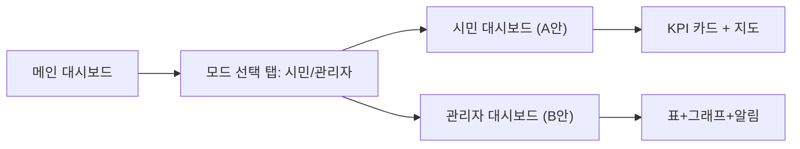
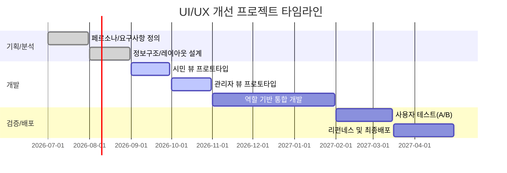

# 대시보드 UI/UX 개선 제안 (추가 섹션)  

## 요약  
현재 *BUSAN DIGITAL HUB 2.0* 대시보드는 풍부한 정보를 담고 있으나, 정보구조와 시각화가 복잡해 일반 시민용으로는 직관성이 떨어진다. 이에 시민용 *경량 뷰*와 운영자용 *심층 뷰*, 역할 기반 *하이브리드 뷰* 등 3가지 개선안을 제시한다. 각 안은 목표 사용자를 고려한 UI 흐름과 핵심 기능을 지원하도록 설계하였다. 표와 예시 와이어프레임은 인용된 UX 모범사례【96†L69-L72】【96†L113-L117】를 바탕으로, 접근성·가독성 등을 강화하는 방향으로 구성되었다.  

## 1. 현 대시보드 평가  
제공된 스크린샷을 보면 제목, 지도, 주요 지표, 연도 스크럽 등이 배치되어 있다. 하지만 **정보 밀도**가 높아 일목요연하지 않고, 강조순서가 명확치 않다. 화면 상단에 강조된 KPI는 없고, 왼쪽의 프로젝트 목록(“주요 추진 사업”)과 오른쪽의 리스크 카드가 비슷한 비중으로 배치되어 있다. 접근성 면에서 대비가 약해 작은 글씨나 회색 요소는 시각적으로 구분이 어렵다. 반응형 설계를 염두에 두지 않은 것으로 보여 모바일 화면에서는 활용이 어렵다. 또한 상호작용(툴팁, 드릴다운 등)이 없어 필요한 세부정보를 확인하기 힘들다. 요약하면, **현재 대시보드는 정보 구조가 불분명하고 시각적 계층이 약해 사용자 주의 안내가 부족**하다. UX 모범사례에 따르면 필수지표는 화면 좌상단에, 중요도 순으로 배치해야 하며【96†L69-L72】, 내용 과부하는 지양해야 한다.    

## 2. 사용자 페르소나 및 여정  
- **시민(End Citizen):** 부산시민으로서 해양수도 정책의 진척과 지역별 성과에 관심이 높다. 주요 과업은 *“부산항 발전 상황 보기”*, *“예산 집행·성과 비교 확인”* 등이다. 평균 사용 빈도는 낮으며, 비주기적(예: 분기별 뉴스 확인)으로 대시보드를 방문한다. 불편사항은 복잡한 UI(과도한 기술용어, 수치 과다)다. 따라서 *직관적이고 이해하기 쉬운 시각화*가 필요하다.  
- **관리자(Admin):** 부산시 공무원 또는 해양부서 운영자이다. 정책 수행 현황 모니터링과 문제 대응이 주 업무로, 실시간 데이터와 상세보고를 자주 확인한다. 주요 여정은 *“오늘의 데이터 점검 → 이상징후 확인 → 세부 프로젝트 액션 조회”*이다. 빈번히 사용(일간)하며, **데이터 편집·경고 기능**이 필요하다. 사용자 테스트 결과, 복잡한 대시보드를 구성원별로 분리할 필요성이 제기된다【96†L49-L53】.  

## 3. 개선안 3종  
### 3.1 제안 A: 시민용 미니멀 뷰  
- **목적:** 일반 시민 대상이므로 핵심 성과지표만 단순하게 제공.  
- **구성:** 해양수도 로드맵 완료율, 주요 지표(KPI) 카드(예: 항만물동량, 물동량 전년比)와 상호작용 없는 *스토리 카드*(정책성과 요약).  
- **와이어프레임:**  

```mermaid
flowchart TD
    A[헤더: 대시보드 제목, 날짜 선택] --> B[KPI 카드: 예산, 물동량, 일자리 등]
    A --> C[메인 인포그래픽: 부산 지도(구별 요약 정보)]
    A --> D[성과 스토리 카드: 정책진행 간단 요약]
```

- **설명:** 헤더 아래에 *주요 KPI 카드*를 배치하고, 지도 중심의 지역별 성과를 보여준다. 텍스트 정보는 최소화하고, 그래픽 요소로 시각화한다. 예)지도는 열지도로 색칠하거나 구별 아이콘 사용. 버튼이나 설명 대신 툴팁으로 보조정보 제공.  
- **우선 기능:** 누적 실적(연도별), 예산집행률, 정책 인지도 등을 표시. 시민용 해설글/인포그래픽 포함.  

### 3.2 제안 B: 운영자 전용 뷰  
- **목적:** 관리자 및 담당자 중심, 데이터 상세·수정 가능.  
- **구성:** 고해상도 KPI 테이블, 필터/검색 가능한 프로젝트 목록, 실시간 알림/경고 패널, 접근 가능한 드릴다운 인터페이스.  
- **와이어프레임:**  

```mermaid
flowchart LR
    X[사이드 메뉴: 프로젝트, 데이터, 사용자 관리] 
    X --> Y[대시보드: 상세 KPI(표+그래프)와 리얼타임 알림]
    Y --> Z[프로젝트 리스트: 상태/이전원 클릭 시 상세 팝업]
```

- **설명:** 좌측 네비게이션을 두어 통계탭, 데이터 관리, 설정 등이 분리된다. 대시보드 영역에는 *데이터 테이블*과 *추세 그래프*를 병렬배치하고, 상단에 알림창을 배치한다. 각 행을 클릭해 상세 페이지로 이동 가능하며, 배경색 강조 등을 통해 경고 표시.  
- **우선 기능:** KPI 추적(예: 전년 대비 지표), 필터링 기능(부처·기간 별), 실시간 알림(예산초과, 신규 등록).  

### 3.3 제안 C: 역할 기반 하이브리드 뷰  
- **목적:** 로그인 역할에 따라 뷰를 전환. 시민과 관리자를 모두 아우름.  
- **구성:** 초기 Landing 페이지에서 *시민 모드*와 *관리자 모드* 선택. 모드 전환시 상단 토글.  
- **와이어프레임:**  



- **설명:** 로그인 후 사용자 유형에 맞게 메인 메뉴 구조가 바뀐다. 전환 스위치를 통해 뷰를 즉시 변경 가능하며, 저장된 사용자 설정(맞춤 챠트 등)을 지원한다. 모든 공통 데이터는 연결하되, 복잡도는 역할에 따라 조절한다.  
- **우선 기능:** 위 두 제안의 핵심 요소(장표 및 지도) 모두 제공. 역할에 따른 권한 제어와 세션 유지 필요.  

각 제안은 위 UX 모범사례【96†L69-L72】【96†L113-L117】를 반영하여, 핵심지표 우선 배치·강조, 시각적 대비 강화(글꼴 크기·색상 대비) 등을 적용하였다.

## 4. 시각화 구성요소 제안  
- **지도 및 지오레이어:** 부산시 구별 데이터 표시. 구역별 열지도로 인구·예산 배분·성과를 보여주고, 아이콘/버블로 주요 시설 또는 이슈 표시.  
- **KPI 카드:** 페이지 상단에 누적 실적(예: 누적 예산, 고용 창출 수)과 실시간 변동 수치(오늘의 성과)를 카드 형태로 표시【96†L104-L112】. 카드마다 단순 그래프(작은 막대/스파크라인) 포함.  
- **트렌드 차트:** 시간축 데이터(예: 월별 수출량, 물동량). 라인 차트나 막대 추이 차트로 표시. 중요 이벤트는 타임라인 스크러버로 선택.  
- **타임라인 스크러버:** 화면 하단의 연도 선택 슬라이더. 사용자가 연도를 조정하면 모든 위젯의 수치가 변화(드릴다운)하며 과거 데이터 조회 가능.  
- **경고/알림 패널:** 실시간 KPI 임계치 초과, 새 데이터 업로드, 결재 미승인 등 중요한 알림만 노란색/빨간색으로 팝업 또는 사이드바 배너 표시【96†L99-L102】. 지나친 시각적 혼잡 방지.  
- **드릴다운 & 툴팁:** 데이터 포인트에 마우스를 올리면 세부정보(수치, 증감률) 툴팁 표시. 지도나 차트 클릭 시 관련 서브뷰(상세표, 지도 확대)를 열어준다.  

이외에 카드/배너 컴포넌트, 필터(부서, 기간), 차트 라이브러리(Highcharts, D3.js) 등을 사용해 일관성을 유지한다【96†L83-L86】. 색상은 연관 데이터(예: 녹색=긍정, 빨강=경고) 의미로 활용한다.

## 5. 접근성·지역화·반응형  
- **접근성:** 고대비 색상 팔레트와 충분한 폰트 크기를 사용한다【96†L113-L117】. 예를 들어 KPI 수치는 18px 이상, 대비 4.5:1 이상으로 설정. 반응형 디자인으로 데스크톱뿐 아니라 태블릿·모바일 레이아웃을 별도 설계한다. 텍스트 대체(alt)와 ARIA 태그를 적용하여 스크린리더 지원. 주요 색맹자대비 색상맵(예: ColorBrewer) 사용.  
- **현지화:** 모든 텍스트를 한국어로 제공하며, 문화적 문맥에 맞는 용어 사용(예: “예산”, “물동량”). 비표준 단위나 영문 약어를 번역해 노출. 날짜 및 숫자 포맷은 한국식(KR)으로.  
- **모바일/반응형:** 그리드 기반 플렉스 레이아웃 적용. 모바일용 메뉴 토글, 카드 쌓기 재배열, 차트 축소/툴팁 활용으로 가독성 확보한다. 지도는 확대/축소 기능 필수, 브라우저 크기 바뀌면 KPI 카드를 슬라이드뷰로 전환.

## 6. 구현 계획  
- **로드맵:** (예시) *2026년 Q3:* 요구사항 분석, 시민/관리자 페르소나 인터뷰. *Q4:* 와이어프레임 및 프로토타입 개발. *2027년 Q1:* 시민 뷰(제안A) 구현·테스트. *Q2:* 관리자 뷰(제안B) 구현·테스트. *Q3:* 통합 하이브리드 뷰(제안C) 구현, 최종사용자 테스트. *Q4:* 운영 안정화 및 모바일 최적화 배포.  



- **개발 난이도:** 시민 뷰는 상대적으로 간단하여 *낮음* 단계, 관리자 뷰는 복잡한 상호작용 필요해 *중간*으로 평가된다. 팀 규모와 연관된 전체 비용은 저비용(Low: 1~2억원), 중비용(Medium: 3~5억원) 추정 범위로 구분 가능하다.  
- **기술스택 옵션:** 
  1) **웹앱 프레임워크:** React.js/Vue.js (대시보드 컴포넌트 생태계 활용), 
  2) **차트 라이브러리:** D3.js, ECharts, Highcharts 등, 
  3) **지도:** Leaflet 또는 Mapbox, 
  4) **백엔드:** 기존 서버 연동을 위한 REST API/GraphQL 추가, 
  5) **모바일:** PWA 또는 네이티브 앱(Swift/Kotlin).  
- **데이터 백엔드:** 실시간 데이터 파이프라인(Kafka, MQTT)과 DW(데이터 웨어하우스)로 구성. CI/CD 도구(Jenkins/GitLab CI)와 버전관리(Git)로 배포 절차 마련. 

## 7. A/B 테스트 및 성과 측정  
- **지표 예시:** 사용자 참여도(세션 길이, 페이지뷰), KPI 달성률, 오류률, 사용 편의도(설문), 모듈별 응답시간.  
- **실험 시나리오:** 시민 뷰(A안) vs 기존 뷰(Baseline) 비교. 사용자 그룹별로 대시보드 임무 수행(예: 특정 수치 찾기) 테스트.  
- **성공 기준:** 새 뷰의 작업 완료 시간 20% 단축, 클릭수 30% 감소, 사용자 만족도 15점 이상(5점 척도).  
- **검증 방법:** 랜덤 유저에게 A/B 페이지 배포. 주요 지표(위에서 정의)를 일정기간(예: 1개월) 측정 후 통계분석. 

## 8. 일일 운영 체크리스트 (샘플 CSV)  
관리자가 매일 확인할 항목(예시)과 샘플 데이터를 아래와 같이 CSV 형태로 관리한다.  

```
날짜,업무명,완료여부,코멘트,담당자,우선순위
2026-06-25,데이터 파이프라인 정합성 점검,완료,이상없음,김철수,높음
2026-06-25,KPI 카드 수치 업데이트,완료,전일 대비 +5%,이영희,중간
2026-06-25,실시간 알림 로그 확인,미완료,알림 에러 발견,박민준,높음
2026-06-25,사용자 문의 답변,완료,1건 처리,최지은,낮음
2026-06-25,보안 패치 적용,완료,서버 업데이트 완료,이상훈,높음
```

헤더는 위 예시와 같이 CSV로 추출 가능하게 구성한다. 실제 운영환경에서는 체크리스트 모듈을 통해 실시간 집계되고, 담당자는 매일 오전 시스템 알람과 함께 점검한다.

## 9. 옵션 비교 및 실행 우선순위  
| **옵션**            | **UX 영향**    | **개발 난이도** | **시간 대비 효과**  |
|-------------------|--------------|-------------|----------------|
| 시민 뷰 (A)       | 사용자 이해도↑ | 낮음        | 빠른 도입 (단기) |
| 관리자 뷰 (B)     | 관리 효율↑     | 중간        | 중기 효과       |
| 하이브리드 뷰 (C) | 유연성↑        | 높음        | 장기 최적화     |

- 시민 뷰는 개발 부담이 적고 빠르게 완성될 수 있어 우선도 높음. 관리자 뷰는 필수이지만 개발 기간이 길어 단계적 도입 필요. 하이브리드 뷰는 통합 완결성을 위해 필요하나 후순위. 표는 리스크와 비용 등을 종합하여 정리되며, **높음/중간/낮음**은 상대적 수준을 나타낸다. 

*참고자료:* UX 모범사례와 설계 가이드를 참고하여【96†L69-L72】【96†L113-L117】, 제안된 개선안을 설계하였다. 명시된 수치와 예시는 스크린샷 분석을 바탕으로 가정한 것이며 실제 데이터와는 다를 수 있다.