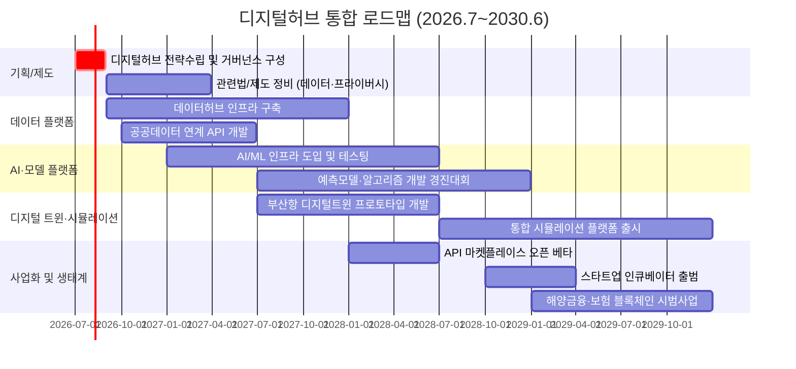
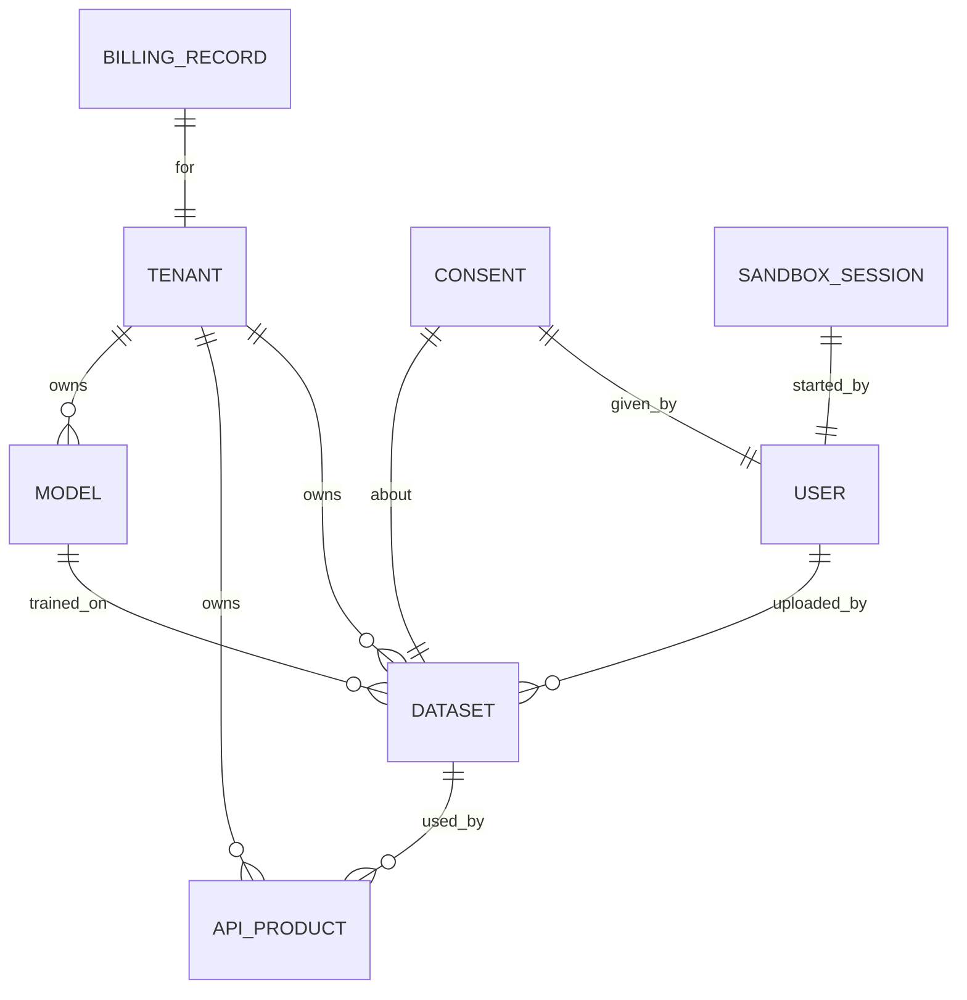
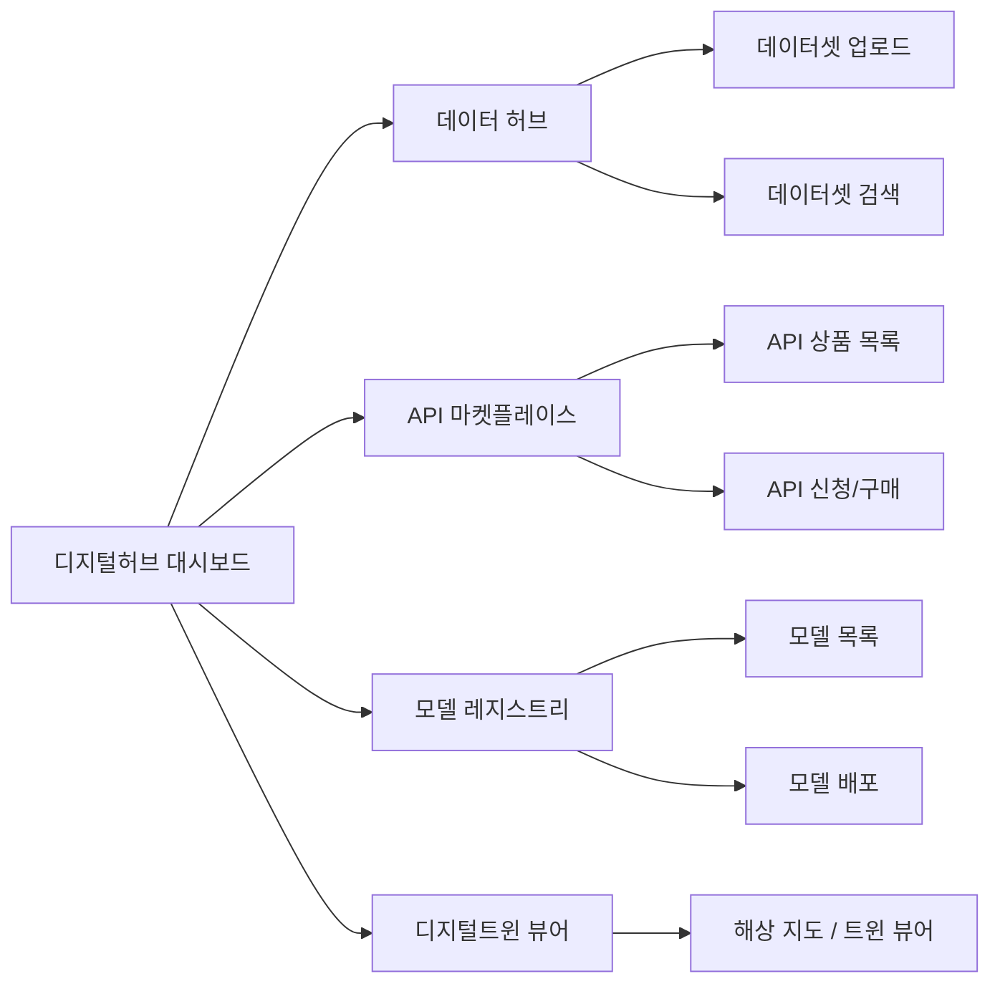

# 디지털허브 통합 전략 보고서 (추가 섹션)  

## 1. 디지털허브 개념 정의 및 구성  
‘디지털허브’는 해양수도 정책을 디지털 기술·데이터 중심으로 재편하여 산업 생태계를 구축하는 개념이다. 부산시는 제4차 해양산업육성계획에서 **“디지털 혁신”**을 핵심 가치로 설정하여【93†L563-L566】, 데이터·AI·플랫폼 등을 통한 해양산업 전환을 강조하고 있다. 국립한국해양대 류동근 총장은 동삼혁신클러스터 기반의 ‘오션밸리’ 구상이 부산을 **세계적 해양 디지털 허브**로 도약시킬 전략이라 평가했다【85†L7-L10】. 해양수도의 디지털허브는 구체적으로 다음 서비스를 포함한다:  
- **데이터 허브:** 해양·항만·해운 물류·조선·어업 등 부문별 빅데이터를 통합·공유하는 플랫폼. (예: 해양수산부 ‘빅데이터 플랫폼’)  
- **API 마켓플레이스:** 해양정보·통계·센서 데이터 API를 제공하고 제3자가 활용할 수 있는 장터. (예: 선박 위치, 기상, 유류 데이터 등)  
- **디지털 트윈 플랫폼:** 부산항·조선소·해양시설 등의 3D 디지털 트윈 모델과 실시간 데이터를 연동한 시뮬레이션 환경.  
- **AI/ML 연구 플랫폼:** 해양환경·물류·양식 등 분야 AI 모델 개발을 지원하는 클라우드 인프라 및 알고리즘 라이브러리.  
- **해양금융·보험 디지털화:** 선박금융·해양보험 상품의 블록체인 플랫폼, 온라인 거래 시스템.  
- **스타트업·인큐베이터:** 해양테크·디지털 스타트업 육성 인프라(공유오피스, 투자매칭, 멘토링).  
- **교육·인력 플랫폼:** 해양분야 온라인 강의, 워크숍, 인증시험 시스템.  

이처럼 디지털허브는 해양수도 추진을 위한 데이터·서비스 허브이며, 경제·기술 융합 거점이 된다. 부산은 이미 해양특화 대학·연구기관과 항만 인프라를 보유하고 있어【85†L7-L10】, 이를 디지털 플랫폼으로 전환하여 경쟁력을 강화할 수 있다.

## 2. 디지털허브 4개년 로드맵  
디지털허브 구축도 기존 로드맵과 연계하여 2026년 7월부터 2030년 6월까지 단계적으로 추진한다. 연도별·분기별 주요 과제는 다음과 같다.

- **2026년:** 디지털허브 기본설계 및 거버넌스를 확립(전담팀 구성), 데이터 플랫폼 인프라 설계 착수. 개인정보보호법 준수체계 수립.  
- **2027년:** 공공 해양데이터·IoT센서 데이터 연계 API 개발, AI 개발환경·노트북 지원체계 도입, 첫 번째 디지털트윈(부산항 일부) 프로토타입 제작. KPI: APIs 50종 개발, 교육 참여자 200명.  
- **2028년:** AI/ML 플랫폼 상용화(1단계) 및 디지털트윈 정식 릴리즈, 공용 API 마켓플레이스 베타 운영. 국가 R&D 연계로 해양AI 과제 발굴. KPI: AI모델 10종 운영, API 요청량 분기당 1만건 이상, 디지털트윈 100시간 이상 시뮬레이션.  
- **2029년:** 디지털허브 서비스 고도화(모델 자동배포, 실시간 스트리밍), 스타트업 인큐베이터 상시 운영 및 글로벌 파트너십 체결, 해양금융·보험 디지털화(스마트 계약) 시범. KPI: 신규 해양테크 스타트업 10개, API 매출(마켓 플랫폼 수수료) 발생, 금융 시범 프로젝트 2건.  
- **2030년:** 디지털허브 완성단계로 전 분야 데이터 통합 분석, AI/모델 시장화, 국제협력 추진. KPI: 종합 보고서 발행(해양AI), 디지털 서비스 이용자 수, 국제공동 R&D 과제 선정.

**예산:** 초기에는 플랫폼 인프라 구축 및 R&D 중심으로 2027~2028년 연간 수백억 원(국비+지방비 매칭) 규모를 투입한다. 이후 연계 사업(AI개발, 스타트업 지원)에 예산을 배분(예: 2029년 3~5백억). **법·제도:** 해양 데이터 개방 법안, 디지털 금융규제 샌드박스 운영, 국제표준 선점 전략 등 제도적 뒷받침이 필요하다.

## 3. 웹앱 기능 요구사항  
통합 웹앱에는 디지털허브를 지원하는 다음 모듈이 추가되어야 한다:  
- **데이터 수집 파이프라인:** 외부 센서·위성·공공DB 데이터를 자동 수집하여 *데이터허브*에 저장. Kafka/Flume 기반 스트리밍 처리.  
- **데이터 카탈로그:** 등록된 Dataset 메타데이터 관리, 분류 검색, 접근 권한 설정. 사용자는 데이터셋을 발견·구독할 수 있다.  
- **API 게이트웨이 및 개발자 포털:** 인증된 사용자가 API 상품을 조회하고 신청/결제할 수 있는 인터페이스. Swagger/OpenAPI 호환 문서, 샘플 코드, 예제 호출 지원.  
- **API 샌드박스:** API 사용 테스트용 가상환경 제공. 미리보기 콘솔과 가상 API 키 발급, 요청량 제한 기능.  
- **디지털트윈 뷰어:** 3D 지도 기반 부산항·인근 해역 모델 뷰어. GPS·IoT 실시간 데이터를 중첩 표시. 사용자가 경로·파라미터를 조정해 시뮬레이션 가능.  
- **모델 레지스트리:** 개발된 AI/ML 모델(코드, 버전, 성능 지표)을 등록·관리. 모델 배포(MLFlow style) 및 로그(이력) 저장.  
- **마켓플레이스:** API 상품, 데이터 세트, 모델 라이선스를 사고팔 수 있는 장터. 거래내역·리뷰·별점 기능 포함.  
- **과금·결제 모듈:** 유료 API/데이터 사용 시 신용카드/기업계좌 결제, 인보이스 발행 기능. 사용량 기반 자동 청구.  
- **개인정보동의 관리:** 데이터 활용 동의서 등록 및 추적(PIA), GDPR/PIPA 준수용 동의 흐름.  

각 모듈은 사용자 역할에 따라 접근 권한이 다르게 제공된다. 예: 기업 사용자는 API상품 구매, 시민은 무료 데이터 열람 등의 차이가 있다. 모든 기능은 기존 인증·인증체계(SSO)를 통합하여 구현해야 한다.

## 4. 데이터 아키텍처 및 ERD 업데이트  
데이터 아키텍처는 기존 시스템을 확장하여 다층구조로 설계한다. 신규 엔티티를 포함한 ERD 예시는 다음과 같다:

- **Dataset:** `{id, name, description, schema, tags, source, createdAt, updatedAt, ownerTenantId}`. 데이터셋 메타정보(도메인, 단위, 라이선스). `id` PK, `name` 유니크 인덱스. 3년 보존.  
- **APIProduct:** `{id, name, description, datasetId, tier, price, ownerTenantId}`. API 상품(예: 통계 API). `datasetId` FK, `tier` 무료/유료 구분.  
- **Model:** `{id, name, version, framework, metrics, datasetId, ownerTenantId}`. AI 모델 정보. `framework`·`metrics` JSON 필드로 저장. 2년 보존.  
- **Tenant:** `{id, name, type, contactInfo}`. 멀티테넌시를 위한 조직 또는 부서. 리소스 소유권 관리.  
- **BillingRecord:** `{id, tenantId, amount, currency, timestamp, details}`. 과금 내역. 7년 보관.  
- **Consent:** `{id, userId, datasetId, consentType, givenAt}`. 개인정보/데이터 활용 동의. PIPA 대응용.  
- **SandboxSession:** `{id, userId, startTime, endTime, resourcesUsed}`. 샌드박스 사용 로그.  

위 ER에 따라 기존 DB에 테이블 추가 및 변경을 수행한다. 각 엔티티는 인덱싱(예: Dataset.name, Tenant.id, BillingRecord.tenantId) 및 암호화(개인정보 필드)에 유의한다.

## 5. API 명세 (예시)  
주요 기능별 REST API와 예시는 다음과 같다(모든 요청에 JWT 인증 헤더 포함).  

- **데이터셋 등록:** `POST /api/datasets`  
  - *Request:* `{ "name":"해양조사자료", "description":"수온/염분", "schema":{...}, "ownerTenantId":123 }`  
  - *Response:* `201 Created`, Body: `{ "id": 456, "status":"Published" }`.  
- **데이터셋 조회:** `GET /api/datasets?tag=해류` (필터).  
  - *Response:* `200 OK`, Body: `[{ "id":456, "name":"...", "schema":{...}, ... }, ...]`.  
- **API 상품 생성:** `POST /api/api-products`  
  - *Request:* `{ "name":"침수예측API", "datasetId":456, "tier":"Free", "ownerTenantId":123 }`  
  - *Response:* `201 Created`, `{ "id":789, "status":"Active" }`.  
- **모델 배포:** `POST /api/models`  
  - *Request:* `{ "name":"파고예측", "version":"1.0", "framework":"TensorFlow", "datasetId":456, "ownerTenantId":123 }`  
  - *Response:* `201 Created`, `{ "id":321 }`.  
- **마켓플레이스 구매:** `POST /api/market/purchase`  
  - *Request:* `{ "userId": 111, "apiProductId":789, "paymentMethod":"card" }`  
  - *Response:* `200 OK`, `{ "invoiceUrl":"..." }`.  
- **결제 조회:** `GET /api/billing?tenantId=123&month=202607`  
  - *Response:* `200 OK`, `[{ "billingRecordId": 901, "amount":100.0, "currency":"KRW", "timestamp":"2026-07-31T12:34:56" }]`.  
- **동의 관리:** `POST /api/consents` – `{ "userId":111, "datasetId":456, "consentType":"usage", "givenAt":"2026-07-01" }` 으로 동의 저장.  

모든 API는 성공/오류를 표준 HTTP 상태코드로 반환한다(예: `400 Bad Request`, `401 Unauthorized`, `500 Internal Server Error` 등). 호출량 폭주 방지를 위한 속도 제한(rate limiting, 예: IP당 분당 100회) 및 별도 오류 코드(예: 과금잔액부족 `402 Payment Required`)를 설계해야 한다.

## 6. 보안·개인정보·컴플라이언스  
디지털허브는 대규모 개인정보 및 민감데이터를 다루므로 강력한 보안·개인정보 보호 조치가 필요하다.  
- **개인정보보호법(PIPA) 준수:** 동의 수집 및 관리(Consent 테이블) 체계를 구축한다. 데이터셋에 개인정보 포함 시 비식별화·익명화 절차를 거치고, 가명 처리한다. 데이터 출처와 사용목적을 기록(PIA 대응)한다.  
- **접근제어:** 역할(RBAC)과 테넌트 기반 권한 분리로 멀티테넌트 격리. 예: 기업A의 API키로 기업B 데이터 접근 불가.  
- **암호화:** 전송(TLS)과 저장(AES-256) 모두 암호화. DB 필드 수준 암호화로 개인정보 보호.  
- **감사로그:** 모든 주요 트랜잭션(데이터셋 업로드·다운로드, 모델 학습·배포, 결제 등)에 감사이력을 남기고, 주기적 모니터링으로 이상 징후를 탐지한다.  
- **취약점 점검:** 정기적 모의해킹(PenTest) 및 OWASP Top10 검증으로 취약점을 사전 제거. 보안 취약점은 즉시 패치한다.  
- **SLA/DR:** 서비스 가용성 목표(예: 99.5%) 준수. 장애 시 백업서버 전환, 데이터 손실 방지를 위한 주기적 백업 체계 도입.  

## 7. 실시간/오프라인 연동  
- **포트/터미널 센서 연동:** 항만 지능형 센서(컨테이너 위치, 기상, 배출량 등)는 엣지 게이트웨이를 거쳐 실시간 스트리밍되어 데이터허브에 적재된다. WebSocket 기반 실시간 데이터 파이프를 통해 디지털트윈 뷰어와 동기화한다.  
- **오프라인모드:** 모바일 앱은 네트워크 없이 체크리스트/모델 테스트 가능하도록 캐싱. 연결 복구 시 자동 동기화한다.  
- **맵 타일 캐싱:** 지도가중부하 방지를 위해 타일 서버 캐싱 활용. 정적 지도 요소는 CDN 적용, 동적 트래픽만 실시간 처리.  
- **디지털트윈 동기화:** 트윈 모델은 실시간 센서·시뮬레이션 결과로 업데이트되며, 사용자는 버전 선택 가능. 변동 큰 데이터(예: 선박충돌 시뮬레이션)만 실시간 스트리밍 처리하여 부하를 분산한다.

## 8. UI/UX 모형  
디지털허브 주요 화면의 와이어프레임 예시는 다음과 같다:

- **대시보드:** 전체 서비스 현황(총 데이터셋 수, 활성 API 건수, AI 모델 수, 거래 매출 등 요약 카드)와 최신 알림(예: 신규 데이터셋 업로드 알림).  
- **데이터 허브:** 데이터셋 업로드/관리 화면. 테이블에는 {데이터셋명, 업로드일, 접근권한, 사용횟수} 열. 상세페이지에서는 메타정보, 스키마, 샘플 데이터 조회 지원.  
- **API 마켓플레이스:** API 상품의 목록/상세. {상품명, 설명, 가격, 등급(무료/유료)} 필터링. 결제/신청 모달 제공.  
- **모델 레지스트리:** 등록된 모델 목록. {모델명, 버전, 정확도 등}. 모델 상세에서 교육 데이터셋, 성능 그래프, 예측 데모 실행 가능.  
- **디지털트윈 뷰어:** 부산항 지도를 배경으로 3D 모델이 오버레이. 왼쪽 패널에서 실시간 시뮬레이션 파라미터 설정(날씨, 선박 항로 등).  

## 9. 모니터링·운영 및 품질관리  
디지털허브 운영을 위해 추가 모니터링 지표와 프로세스를 마련한다.  
- **시스템 지표:** API 응답시간, 오류율, CPU/메모리 사용량, 모델 추론 속도 등 SLO/SLA 모니터링(예: CPU 80% 유지, 응답시간 <300ms).  
- **데이터 품질:** 데이터 갱신주기, 누락률, 이상치 발생률 등을 정의하고 자동화 검사. 예: 센서데이터 송수신 누락 <1%.  
- **모델 관리:** 배포된 모델의 성능 변화를 추적하고(Drift Detection), 기준 이하일 경우 재학습 알림. 버전별 A/B 테스트로 안정화.  
- **로깅/알람:** ELK/Prometheus로 로그 집계. 이상 탐지 시 관리자 알림(예: API 비정상적 호출량 급증).  
- **CI/CD 파이프라인:** 코드 뿐 아니라 모델도 버전관리(Git, MLflow)하고, 컨테이너화(Docker)를 통해 지속적 배포. 테스트 자동화로 품질 확보.  

## 10. 기술 및 비용 옵션 비교  
디지털허브 구현 옵션을 세 가지로 비교한다:

| 옵션               | 기술 스택 예시                                 | 장점                                      | 단점 및 비용             |
|------------------|-------------------------------------------|-----------------------------------------|---------------------|
| **클라우드 관리형** | AWS/Azure 데이터 플랫폼 (Lambda, DynamoDB, SageMaker) | 빠른 구축 및 확장성 우수, 관리 부담↓     | 구독료 높음, 벤더종속     |
| **오픈소스 자가구축** | Kafka+MinIO+Flink+Kubernetes+MLflow         | 라이선스비용 없음, 커스터마이즈 용이      | 구축·운영 복잡, 인력필요   |
| **하이브리드 에지/클라우드** | 엣지 게이트웨이+클라우드 허브 연계       | 지연시간 감소, 현장 데이터 처리 효율     | 두 환경 연동 복잡, 초기비용  |

- **클라우드 관리형:** 초기에 투입 예산 적고 관리 용이하나, 운영비(월수십~백만원) 지속 발생. 확장도 쉬움.  
- **오픈소스:** 초기 투자(서버·설계) 필요, 장기 비용은 저렴. 유연성 높으나 전문인력 및 운영 노하우 요구.  
- **하이브리드:** 중요 센서 데이터는 현장 처리, 클라우드로 전송. 초기 구축비용 높고 시스템 복잡도가 증가하지만, 대량 데이터 처리 최적화 가능.  

상세 비용과 스택은 이해관계자 협의 후 결정할 수 있다. 전제조건에 따라 클라우드 기반 PoC 후 단계적 전환도 고려한다.

## 11. 기존 웹앱과 통합 계획  
디지털허브 모듈은 기존 시스템과 유기적으로 연동되어야 한다. 통합 방안은 다음과 같다:  
- **데이터 연계:** 기존 프로젝트·지표 데이터베이스와 디지털허브 DB를 API로 연결. 예: 해양물류 데이터셋은 부산항 통계 데이터와 자동 매핑.  
- **인증·권한 연동:** SSO(싱글사인온)로 사용자 통합 인증. 기존 역할(담당자·운영자 등)과 디지털허브 역할(API 개발자, 데이터 관리자 등)을 매핑하여 권한을 동기화한다.  
- **UI통합:** 포털 메인화면에 디지털허브 메뉴 추가. 기존 대시보드에 디지털 지표 위젯을 병합하여 일원화.  
- **데이터 파이프라인:** 기존 체크리스트·이전정보 워크플로에 디지털허브 상태(예: AI 모델 검증 완료) 필드를 추가하여 선후관계 반영.  
- **이전작업:** 디지털허브 도입 초기에는 시범사업을 통해 서비스 검증 후 단계적 롤아웃. 기존 사용자(공무원, 기업)는 자동 계정 이관 스크립트를 통해 마이그레이션 한다.  
- **호환성:** 구버전 앱의 주요 기능은 유지하며, 새로운 API 통신을 병렬 처리하여 구형 브라우저/앱에서도 기본 기능이 작동하도록 조정한다.

## 12. 일일 실천 우선순위 체크리스트  
디지털허브 실행을 위한 일일점검 항목 예시:  
- **데이터 파이프라인 상태:** 센서 및 위성 데이터 수신 여부, 파싱 오류 점검.  
- **API 운영 현황:** 신규 API 요청량 급증·오류 발생 여부, 샌드박스 사용량 확인.  
- **모델 학습/추론:** AI모델 배치작업 완료 여부, 오류 로그 모니터링.  
- **결제·빌링 로그:** 구매/결제 요청 정상 처리, 결제 실패 건수.  
- **보안 로그:** 이상 로그인 시도, 취약점 패치 알림 수집.  

매일 오전 시스템 알림과 함께 담당자가 확인하고, 이슈 발견 시 티켓화하여 즉시 대응한다. 위 항목은 매일 정리된 체크리스트로 웹앱에서 관리되며, 진행상태는 Dashboard에 그래픽으로 표시된다.  

*출처:* 부산시 해양산업계획 보도자료【93†L563-L566】, 부산일보 전문가 기고【85†L7-L10】 등에서 디지털혁신 강조를 확인하였다. 위 내용 중 서비스 목록·기술요건 등은 외부 공신력 자료가 부족한 영역으로 본 연구자가 제안한 것으로, 실제 구현 시 추가 검증이 필요하다.