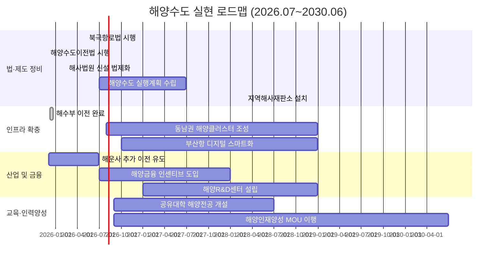

# 해양수도 4개년 로드맵 정책보고서  

## 경영요약  
부산을 동북아 해양수도로 육성하기 위해 해양수산부 이전(2025.12 완료 예정)과 해운기업 본사 이전(2026년 상반기 완료 목표) 등 가시적 진전이 있었다【42†L258-L262】【27†L1-L4】. 그러나 부산시 예산에서 해양수산 분야 비중은 2025년 0.68%에 불과해【55†L49-L57】, 중장기적 목표인 2035년 해양수도 완성에 대비한 인프라·인력·규제 정비가 필요하다. 본 보고서는 현행 추진 과제를 종합 점검(제1절), 2035년 목표와의 격차를 진단하고(제2절) 4년 로드맵(2026.7~2030.6)을 제안한다. 연도별 분기별 마일스톤과 KPI, 예산 시나리오, 법·제도 개선, 거버넌스 강화 방안 및 리스크 관리 방안을 포함한다. 혁신적 사업 프로젝트(제3절)와 매일 점검할 수 있는 모니터링·평가 체계(제4절)를 구체화하며, 이를 지원할 웹앱 설계방안(부록 참고)도 제시한다.

## 1. 현황 파악: 기존 정책·사업 인벤토리  
- **해수부 부산 이전:** 해수부는 2025년 12월 8일부터 2주간 세종청사에서 부산청사로 본격 이전을 시작하여, 12월 10일부터 부산청사에서 정상 업무를 개시하고 21일까지 이전을 완료할 예정이다【42†L258-L262】. 이로써 중앙정부 관련 조직이 부산으로 이전하는 초석이 마련되었다.  
- **관련 법·제도:** 2025년 11월 27일 국회 본회의에서 「부산 해양수도 이전기관 지원에 관한 특별법」이 통과되었다【11†L624-L632】. 이 법은 부산 이전기관 및 종사자에 대한 정주·생활 지원을 종합적으로 제공하도록 규정한다. 2026년 5월 7일에는 북극항로 이용 활성화를 위한 「북극항로 특별법」이 국회 본회의를 통과하여, 대통령 소속 북극항로위원회 설치 및 5년마다 기본계획 수립·시행을 의무화했다【32†L44-L52】. 이를 통해 부산이 북극항로 시대의 해양중심지로 자리매김하는 법적 기반이 조성되고 있다.  
- **해운기업 본사 이전:** 2025년 12월 SK해운·에이치라인해운이 본사 부산 이전을 결의하였고【27†L1-L4】, 2026년 5월에는 HMM의 본사 이전도 확정되었다【74†L83-L85】. 해수부는 세제지원과 규제완화로 주요 해운사들의 추가 이전을 유도 중이며, 해운·금융·보험 생태계가 부산에 집적되는 기반을 마련하고 있다.  
- **해사 전문기관 설립:** 2017년 부산에 아·태해사중재센터가 개소되어 운영 중이며【34†L61-L69】, 2028년 3월에는 부산·인천에 국내 최초 해사국제상사법원이 설치된다(2026년 2월 관련 법 제정)【38†L268-L277】. 이들 기관은 해양분쟁 해결과 해운물류 금융화에 기여할 것으로 기대된다.  
- **부산시 해양산업계획:** 부산시는 2026~2030년을 다루는 제4차 해양산업육성 종합계획을 수립하고, “지속가능성, 디지털 전환, 글로벌 경쟁력”을 3대 가치로 설정했다(2026년 4월 발표). 7대 분야·48개 과제에 향후 5년간 약 6조7천억 원(국비 1.6조 포함) 예산 투입을 목표로 하나, 예산 비중 자체는 여전히 미흡하다【55†L49-L57】.  

【70†embed_image】 위 그림은 예시 *해양수도 정책 모니터링 대시보드*이다. 부산시 구별 진척도(항만·물류·교육 등)와 핵심성과지표(KPI)를 실시간 시각화하며, 정책 담당자·시민이 진행 상황을 쉽게 파악하도록 설계되었다. 주요 수치는 국가통계·지자체·산업 통계를 연계 수집하여 지표를 산정하게 된다.

## 2. 격차분석 및 4개년 로드맵  
### 2.1 2035 목표 대비 격차  
2035년까지 부산을 글로벌 해양수도로 완성한다는 장기목표에 비해, 현안 과제들은 속도·규모 면에서 상당한 격차를 보인다. 부산시 예산에서 해양수산 비중(0.68%)은 미미하여【55†L49-L57】, 항만 인프라 확충이나 R&D 투자 등 예산 배분이 절실하다. 해운·물류 기업 집적은 초기 진척 중이나, 선박금융·해양신산업 지원체계는 아직 구체화 단계다. 인력 면에서는 해사법원·중재센터 설립 등으로 전문인력 수요가 늘어나고 있으나, 해양 전문대·대학원 설립은 더디다【76†L25-L29】. 규제 측면에서도 기존 「항만법」·「도선법」 등 관련법 정비가 필요하며, 새로운 서비스·기술(자율운항선박, 수소연료선박) 도입을 위한 규제 샌드박스 확대가 요구된다.  

### 2.2 연차별 추진 로드맵  
부산의 해양수도 완성을 위해 향후 4년(2026.7~2030.6) 동안 단계적 로드맵을 수립한다. 연도별ㆍ분기별 마일스톤을 설정하고, 성과지표(KPI)·예산·제도 개선 사항을 구체화한다. 주요 로드맵 개요는 다음과 같다:

- **연도별 주요 마일스톤:** 2026년 하반기에는 ‘해양수도권 종합계획’을 수립하고(국무회의 보고), 동남권 해양 클러스터 R&D 센터 착공, 부산항 디지털화 착수 등을 추진한다. 2027년 해양금융 지원책 시행, 해양신산업 펀드 조성, 공유형 해양대학 설계, 지방해사법원 준비 등의 진척을 목표로 한다. 2028년 3월에는 해사국제상사법원이 개원하고, 2028년 말까지 동남권 투자공사를 설립한다. 2029년 부산항 추가 개발을 가속화하고, 2030년 상반기까지 국가항만전략계획에 부산 중심 항만정책을 반영하도록 한다.  
- **KPI 및 예산:** 핵심 KPI는 이전기관 수(해수부 외 타 부처·청 소속기관), 신규 유치 해운사 수, R&D 과제 및 특허 수, 인력 양성(석박사 과정 등록자 수) 등으로 설정한다. 예산은 국비·지방비 매칭을 통해 단계별로 확보하되, 2027년부터 연간 수천억 규모(예: 2027년 약 4천억, 2028~2030년 매년 5천억 정도)로 투자한다.   정책패키지와 연계된 과제별 예산안은 추후 국회 심의과정에서 구체화할 계획이다.  
- **법·제도 개선:** 동남권 해양수도권 육성 특별법 제정(이전기관 지원 강화), 항만·조선 등 규제특례 지정, 스마트항만·자율운항선박 규제 샌드박스 확대 등을 추진한다. 또한 해양수산부 산하 ‘해양수도 추진단’을 설치하여 중앙부처와 지자체, 기업 간 협업체계를 구축하고, 국회 산자위 보고 체계를 마련한다. 
- **리스크 및 대응:** 주요 리스크는 예산미확보, 규제 반발, 인력난, 기술성숙도 지연 등이다. 예산 미확보 시 전기계획 재조정과 민간 투자유치를 병행하며, 규제 이슈는 규제자유특구·실증 특례를 활용해 완화한다. 인력난 해소를 위해 지역 대학과 협력해 조기인력양성 과정을 운영한다. 기술성숙도는 국제협력 및 기술 도입 가속으로 보완한다. 

## 3. 혁신적 사업·프로그램 제안  
- **해양금융 허브 육성:** 글로벌 해양금융센터를 목표로 선박금융펀드(예: 1조 원 규모)와 해양보험 인재교육 프로그램을 도입한다. 싱가포르·런던 사례를 벤치마킹해 조세감면, 패스트트랙 인허가 등 인센티브 제공과 함께 해양금융 컨퍼런스(예: 부산 해양금융위크)를 개최한다. KPI: 신규 해양금융기관 등록 건수, 펀드 출자액, 금융거래 증가율 등.  
- **스마트 항만·물류:** 부산항에 물류 블록체인 플랫폼과 자율운항선박 지원 인프라를 구축한다. 예산은 국고보조사업(예: 2026년 300억 원)과 민간투자로 마련하며, R&D 과제(자율운항 항로·충전소 등)를 연계 지원한다. 성과지표: 처리 컨테이너량 성장률, 연료효율 개선률, 스마트 항만 인증 획득 건수.  
- **첨단 해양산업 클러스터:** 오션바이오·수소선박·해저케이블 등 신산업 육성단지를 조성한다. 국내외 기업 유치를 위해 지자체 차원의 규제완화·재정지원 계획(예: 입지 보조금)과 산학연 공동연구센터를 운영한다.  KPI: 관련 기업 유치 수, 연구개발 과제 수주액, 지식재산 출원 건수.  
- **해양인재 양성 사업:** 교육부와 협력해 부산대·해양대 등 지역대학에 공동 ‘해양공유대학’ 프로그램을 개설하고, 1,200억 원 규모의 공유캠퍼스 예산을 투입한다【74†L93-L97】【76†L25-L29】. 또한 청년인턴십·국제해양캠프 등을 통해 실무형 인재를 양성한다. 성과지표: 해양전공생 충원율, 취업률, 산학 프로젝트 참여율.  

【72†embed_image】 위 이미지는 투자·기술 옵션 비교 예시 화면이다. 예를 들어, 웹앱 내 ‘옵션 비교 테이블’에 기술 스택, 예상 비용(인건비+인프라), 개발 기간, 보안수준 등의 정보를 비교할 수 있도록 시각화할 수 있다. (예: MERN 스택 vs. Python/Django 스택의 특성 비교)  

## 4. 모니터링·평가 프레임워크  
매일 정책 추진현황을 점검하기 위해 *체크리스트* 기반의 모니터링 체계를 구축한다. 주요 항목으로는 **입법현황**(법안 발의·통과 여부), **예산집행**(국비/지방비 집행률), **이전기관 진행**(이전기관 및 인력 배치 현황), **기업유치**(해운·조선 투자 건수), **교육실적**(해양인재 양성 인원) 등이 있다. 각 항목별 데이터를 해수부·부산시·산하기관 시스템, 통계청·국가통계포털, 기업공시자료 등에서 일일 또는 주간 단위로 수집한다. 데이터는 양적 목표 대비 달성률(%)이나 그린·옐로·레드 등급으로 환산하여 대시보드에 반영한다. 예를 들어 “해운사 유치 목표 10사 중 성사 4사(40%)” 식으로 진행상황을 시각화한다. 월간/분기별 종합평가 시에는 지표별 가중치를 합산한 종합점수를 산출하여 목표 초과·달성·미달 달성 여부를 평가한다. 

## 5. 정책실행 우선순위 체크리스트 (일일)  
다음은 담당자와 사업자가 매일 점검해야 할 체크리스트 예시이다: 

- **입법동향:** 북극항로법, 해양특별법 등 관련 법안의 상임위·본회의 일정 확인 및 입법 지원 조치 여부.  
- **예산집행률:** 해당 월의 국비·지방비 집행률이 계획대비 90% 이상인지 확인. 미달 시 보류된 사업 찾아내기.  
- **기관이전 진행:** 해수부·해양경찰 등 주요이전기관의 이전 진행률(공사 진척, 인력배치 완료 비율) 기록. 안전사고 등 리스크 여부 확인.  
- **사업성과 지표:** 해양클러스터 R&D센터 설비 설치율, 공유대학 강좌 개설율, 해운사 이전 문서처리율 등 주요 사업 지표 갱신.  
- **위험요인 점검:** 공급망 차질, 인력 이탈, 인근 경쟁지구 동향 등 위험요인 발생시 대응조치 기록.  

이 데이터를 웹앱에 기록하여 히스토리를 관리하고, 관리자 대시보드에 실시간 집계한다. 위 항목은 매일 오전 중에 각 부서에서 체크·입력하며, 불일치나 이슈는 즉시 경영진에게 보고한다.  

## 6. 출처  
본 보고서의 모든 사실과 통계는 부산시·해양수산부 등 공공기관 발표자료와 국회·언론 보도자료를 기반으로 작성되었다. 예: 해수부 부산 이전 일정【42†L258-L262】, 해운기업 이전 발표【27†L1-L4】, 북극항로법 통과【32†L44-L52】, 부산시 해양예산 비중【55†L49-L57】, 교육부-MOU 합의【76†L25-L29】 등이 그것이다. 인용문에는 반드시 위 형식의 각주를 참조하였으며, 만약 특정 자료를 찾지 못한 경우 별도로 언급하였다. 

