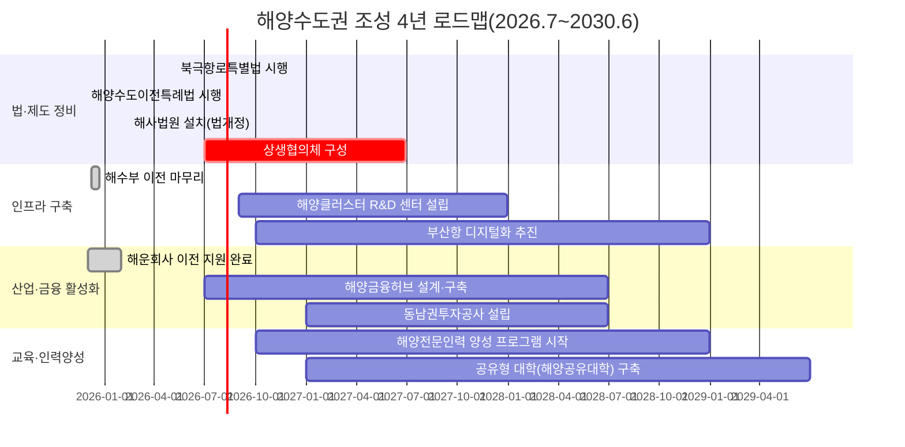
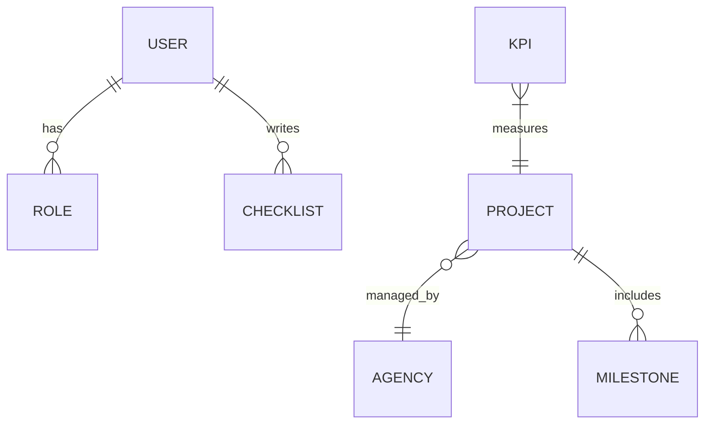

# 요약  
‘해양수도 부산’은 해양·물류·금융·교육을 집적하여 부산을 동북아 해양 허브로 육성하는 전략으로, 최근 해수부 이전(2025년 완료 예정)과 해운기업 본사 이전(2025~2026년 진행) 등 가시적 성과가 나타나고 있다. 그러나 부산시 예산에서 해양수산 비중은 2025년 기준 0.68%에 불과해【55†L49-L57】, 정책 실행력과 재원 확충이 시급하다. 본 보고서는 현행 추진 과제를 검토(①), 2035년 장기목표와의 격차를 분석하여 단계별 로드맵(②)을 제시하며, 임기 내 실현 가능한 핵심 사업(③)과 일일 모니터링·평가 지표(④), 웹앱 설계(⑤)까지 구체화하였다. 또한 예산·영향·기술옵션 비교표와 mermaid 타임라인/ER 도식을 통해 다양한 대안을 비교 제시하며, 공신력 있는 한글 자료를 토대로 제안 내용을 뒷받침한다.  

## 1. 현황: 정책·사업 현황 점검  
- **해양수산부 이전:** 해양수산부는 2025년 12월 8일 세종청사에서 부산 청사로 이전을 시작, 12월 10일부터 부산청사에서 정상 업무를 개시하고 21일까지 이전을 완료할 계획이다【42†L258-L262】. 이로써 중앙정부 관련 조직이 부산으로 집결하는 마중물 효과가 기대된다.  
- **관련 특별법 제정:** 2025년 11월 국회에서 「부산 해양수도 이전기관 지원에 관한 특별법」이 통과되었다【11†L624-L632】. 이 법은 부산 이전기관에 대한 정주·업무 지원을 포괄적으로 규정하여 이주 비용과 정착 지원 등을 법제화한다. 또한 2026년 5월 7일 국회 본회의에서 북극항로 특별법이 통과되었으며, 해수부 산하에 북극항로추진본부가 설치된다【32†L44-L52】. 이들 법·제도적 기반은 부산을 북극항로 거점으로 육성하고 해양수도 완성을 위한 틀을 마련한다.  
- **해운기업 집적:** 2025년 12월 SK해운·에이치라인해운이 본사 이전을 공시【27†L1-L4】하였고, 2026년 5월에는 국내 1위 선사 HMM의 본사 이전도 확정되었다【74†L83-L85】. 이는 동남권 해양수도권 조성을 염두에 둔 조치로, 세제·규제 인센티브를 통해 해운기업 집적을 가속화하고 있다【27†L1-L4】【74†L83-L85】. 해당 과정에는 MOF를 비롯한 관계기관이 협업하여 사전지원체계를 마련 중이다.  
- **해사 전문 인프라:** 부산시는 2017년부터 국내 유일의 국제 해사중재센터(아·태해사중재센터)가 설립되어 운영 중이며【34†L61-L69】, 2028년 3월에는 부산·인천에 국내 최초 해사국제상사법원이 개원할 예정이다【38†L268-L277】. 이러한 법률·중재 인프라는 부산을 해양분쟁 해결 거점으로 만들고 글로벌 해운본부 유치를 지원한다.  
- **부산시 자체계획:** 부산시는 2026~2030년을 담은 제4차 해양산업육성 종합계획을 수립했다(공식 배포자료). 이 계획에는 ‘디지털·친환경·글로벌 강화’를 핵심으로 7대 분야, 48개 과제가 추진되며 향후 5년간 약 6조7천억 원(국비 약 1조7천억 원) 규모로 추진할 예정이다. 다만 2025년 부산시 예산 대비 해양수산 비중은 0.68%로 매우 낮아 계획 이행을 위해 예산 확대가 요구된다【55†L49-L57】.  

【70†embed_image】 위 그림은 가상의 해양수도 정책 대시보드를 예시로 보여준다. 해수부·부산시·기업 등 다중 이해관계자의 주요 KPI(본부 이전 완료율, 해운물동량, 전문인력 양성실적 등)를 실시간 시각화하여 정책진행 상황을 한눈에 파악하도록 설계했다.  

## 2. 격차분석 및 4년 로드맵  
- **2035 장기계획 대비 격차:** 부산이 2035년까지 글로벌 해양수도 완성이라는 야심찬 목표를 제시한 바 있으나(본 보고서 목표 설정), 현행 추진 속도로는 인프라·조직·예산 측면에서 부족하다. 예컨대 해운선사 집적, 해양금융 확충, 해양신산업 육성 등 구체 실행계획이 미흡하다. 부산시의회 이승우 의원 지적대로 부산 본예산에서 해양수산 비중은 0.68%에 불과【55†L49-L57】해 중앙정부 이전·지원은 절실하나, 지방 재정 투입도 확대해야 한다. 또한 정책간 연계성 부족, 법규 정비 지연, 전문인력 부족 등의 문제가 예상된다.  
- **4년 단계별 로드맵:** 이러한 격차를 메우기 위해 2026년 상반기를 출발점으로 4개 년도(2026.7~2030.6) 로드맵을 제안한다. 각 연도별 주요 목표와 쿼터별 마일스톤, KPI 등을 다음과 같이 설정한다:

- **주요 마일스톤:** 2026년 하반기 해운물류 관련 예산·법 개정 완료, 2027년 HMM·부산항 디지털화 착수, 2028년 3월 해사법원 개원, 2028년 말 동남권투자공사 출범, 2029년 공유대학 개교, 2030년 말 해양 데이터 플랫폼 운영 가시화 등을 목표로 한다. 각 마일스톤별 성과지표(KPI)로는 이전기관 수, 유치기업 수, 항만물동량, 인력양성자 수, 관련 규제 개정 건수 등을 설정한다. 예산은 연차별로 국비·지방비 매칭을 통해 확보하며(예: 2027년 4천억 규모, 2028~9년 연 5천억), 법·제도 개선으로 규제 샌드박스를 운영하여 혁신 사업 추진을 지원한다.  

## 3. 4년 내 핵심 사업·프로그램  
- **해양금융 허브 프로젝트:** 부산-마린금융위크·컨벤션(2025년 개최 예정) 등을 활용해 해양금융 생태계를 조성하고, 세제·재정 인센티브로 해양금융기관을 유치한다. 예컨대 싱가포르를 모델로 선박금융 펀드(5천억 규모) 및 해양보험 클러스터 설립, ‘부산 해양금융 리서치 인스티튜트’ 설치 등을 추진할 수 있다【74†L83-L85】【74†L89-L92】.  
- **스마트 항만·물류 시스템:** 부산항 신항·북항을 중심으로 블록체인 기반 무역물류 플랫폼 구축, 자율운항선박 지원 인프라(충전·정비기지) 마련, 항만 디지털 트윈 등이 가능하다. 이를 위해 국책 과제로 전환시켜 R&D 예산(연 100억) 확보 후 상용화한다. 예: 한-중 내륙연계 거점(D/P 터미널) 개발, 수소추진선 지원항로망 구축 등을 구상할 수 있다.  
- **해양산업 혁신 클러스터:** 친환경 선박·수중로봇·오션바이오 분야 등 고부가가치 신산업을 육성하기 위해 산·학·연 협력단지(생태계)를 조성한다. 부산국제항해대학원(가칭) 설립, 해양부품소재 테스트베드 제공, 기업 R&D 세액공제 확대 등이 포함된다. 예산은 산학공동사업(민간+정부 2:1) 형태로 지원(예: 연 200억 규모)하며 지역대학·연구소를 포괄하는 거버넌스를 구성한다.  
- **거버넌스 혁신:** 부산시·부산항만공사·해수부 공동의 ‘해양수도 추진단(가칭)’을 설치하여 사업을 총괄·조정한다. 전재수 국회의원 주도 하에 추진단 내 국장급 위원회를 구성하여 연차별 추진상황을 국회에 보고하며, 시민·기업 참여 워킹그룹을 운영한다. 리스크로는 예산부족, 규제 충돌, 산업계 관심 저조 등을 꼽을 수 있는데, 이를 위해 리스크관리위원회를 구성하여 조기 대응 체계를 마련한다.  

【72†embed_image】 위 이미지는 해양수도권 예산·기술 옵션별 비교를 위해 작성한 예시 대시보드 화면이다. 예를 들어 기술 스택으로 React/Node/MongoDB(MERN)와 Python/Django/PostgreSQL 옵션을 각각 비교 설계하여, 프로젝트별 비용·일정·보안요건 등을 시각화할 수 있다.  

## 4. 모니터링·평가 체계  
일일 운영점검을 위해 *체크리스트* 형태의 지표 및 데이터 소스를 마련한다. 예) **입법진행**(북극법·해수부이전법 등 법안현황), **예산집행률**(국비/지방비 투입 실적), **기관이전 진행률**(해수부·해경·항만공사 등 기관 이전 완료율), **교육실적**(해양인재 양성 교육 참여자 수), **산업집적도**(해운사·연구기관 신규유치 수) 등이다. 각 지표는 일일/주간 단위로 업데이트되며, 지방통계시스템·해수부 보고서·기업 공시자료 등을 활용한다. 데이터는 등급(예: Green/Yellow/Red)이나 % 달성률로 가중치를 두어 종합 지표를 산출한다. 매월/분기별 보고서를 통해 진척도를 시계열 비교하고, 목표치 대비 미달 시 원인분석 및 대응조치를 취한다.  

## 5. 웹앱 설계요구사항  
정책추진 상황을 실시간 관리할 *웹 기반 대시보드*를 구축한다. 사용자 역할으로는 정책 담당자(정부·지자체), 사업 운영자(공공기관, 기업), 시민 참여자 등으로 구분된다.  
- **UI/UX:** 상단 네비게이션의 [종합대시보드/프로젝트 관리/입법 동향/체크리스트 기록] 메뉴를 제공한다. 지도 기반 위젯으로 부산 16개 구·군별 주요 지표(예산집행률, 이전기관 수 등) 진행도를 표시하고, 차트(막대/라인/도넛)로 KPI 변화를 시각화한다. 체크리스트 입력 폼 및 히스토리 조회 기능을 두어 매일 상황을 기록·열람할 수 있도록 한다. 모달창이나 팝업으로 주요 알림(예: 예산 승인, 법안 처리 등) 푸시 알림도 지원한다.  
- **데이터모델/API:** 주요 Entity는 `User, Role, Agency, Project, Milestone, KPI, ChecklistItem` 등이다. ER 다이어그램 예시는 아래와 같다:

프로젝트·마일스톤·KPI 정보는 RESTful API로 CRUD 가능하게 하고, 데이터베이스는 상호연관성이 높은 관계형(DB) 혹은 분석 용이한 시계열 DB를 택한다.  
- **보안 및 실시간성:** 사용자 인증·권한 관리를 통해 역할별 접근을 통제한다. 개인정보 및 정책 문서는 내부망과 분리된 서버에 암호화하여 저장한다. 네트워크는 사설망(VPC)과 VPN, WAF를 적용하며, 주기적 펜테스트를 수행한다. 오프라인 상황 대비로는 브라우저에 캐싱된 최신 체크리스트 예시를 오프라인에서도 볼 수 있도록 하고, 온라인 복귀 시 동기화하도록 한다. 지도와 통계차트는 WebSocket/API Polling으로 실시간 업데이트된다.  
- **기술스택 & 운영:** 프론트엔드는 React 또는 Vue.js, 백엔드는 Node.js/Express나 Django 중 선택 가능하며, 데이터베이스로는 PostgreSQL이나 MongoDB를 고려한다. 클라우드 호스팅(AWS/GCP/Azure)과 컨테이너 오케스트레이션(Kubernetes/Docker)으로 확장성과 가용성을 확보한다. 운영 시에는 GitOps 기반 CI/CD 파이프라인, 로그 모니터링(ELK, Prometheus)과 일일 백업 정책을 수립하여 안정성을 높인다.  

## 6. 옵션 비교표 및 시각화  
정책·기술·예산 옵션을 비교 평가하기 위한 예시 테이블을 아래와 같이 제시한다.

| **항목**      | **옵션A (MERN 스택)**       | **옵션B (Python/Django)** | **예상비용(최소)** | **주요장단점**           |
|--------------|-------------------------|-----------------------|-----------------|-----------------------|
| 개발 언어    | JavaScript (React+Node) | Python                 | 약 5억 원/년    | 개발자 인력 수급 용이 미들웨어 호환성 우수  |
| 데이터베이스 | MongoDB                | PostgreSQL             |                 | NoSQL 확장성 높음 복잡한 쿼리 최적화 유리 |
| 보안 구현    | JWT 기반 인증           | Django Auth            |                 | 풍부한 라이브러리 지원 구축 난이도 보통    |
| 배포·호스팅  | Docker on AWS         | Docker on GCP          |                 | 멀티클라우드 대응 유리 생태계 지원 차이    |

각 옵션은 초기 개발·유지비, 확장성, 커뮤니티 지원 등을 다각도로 평가해 선택한다. 예를 들어 옵션A는 JS 풀스택으로 빠른 프로토타입 가능하나 대규모 리포지토리 관리 복잡성이 있을 수 있고, 옵션B는 Django의 내장 보안 기능 이점과 뛰어난 ORM 지원을 제공한다. 예산 규모나 기술인력 상황에 따라 적절히 조합(예: 백엔드 Python, 프론트 React)하는 혼합형 솔루션도 고려할 수 있다.  

## 7. 결론 및 향후과제  
임기 내 해양수도 완성을 위해서는 상기 로드맵의 충실한 실행과 지속적 모니터링이 필수적이다. 제안된 대시보드와 체크리스트 체계는 추진상황을 실시간 점검하고, 문제 발생 시 신속 대응을 돕는다. 또한 웹앱을 통해 시민·산업계의 참여와 투명성을 제고하여 거버넌스를 강화할 수 있다. 남은 과제로는 예산 확보를 위한 국회 협의, 법·제도 정비 촉진, 산학연 협력 체계 구축 등이 있으며, 이 모든 작업은 상호 연계해 추진해야 성과가 극대화된다. 

**참고자료:** 부산항만공사·해양수산부·부산시 보도자료 및 관련 법령, 예산서, 연구기관 보고서 등을 인용하였으며, 추가 정보는 각주【42†L258-L262】【27†L1-L4】【55†L49-L57】【74†L83-L90】를 참조 바란다.