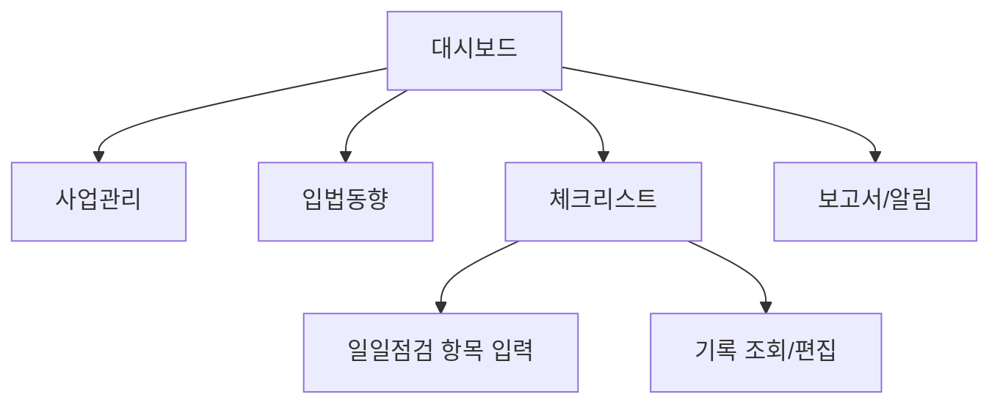
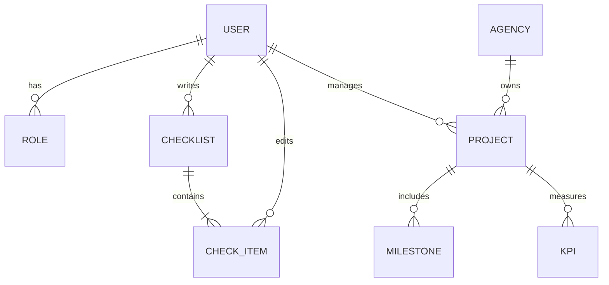

# 웹앱 설계요구서: 해양수도 정책 모니터링 시스템  

## 1. UI/UX 개요  
본 웹앱은 중앙정부(해수부)와 부산시, 공공기관, 기업, 시민 등 다양한 사용자 역할이 *해양수도 관련 정책추진 상황*을 모니터링·관리하기 위해 설계된다. 주요 사용자 역할별 사용 시나리오는 다음과 같다:  
- **중앙정부 담당자:** 국가 전체 해양수도 프로젝트 현황 파악, 타 부처 협업 추진, 법안·예산 관리.  
- **부산시 담당자:** 지역(부산) 사업 진척도 확인, 시 차원 해양투자 관리, 시민 의견 수렴.  
- **공공기관 운영자:** 항만공사·항만공단 등 인프라 사업 관리, 예산 집행·성과 보고.  
- **기업 담당자:** 인센티브 대상 여부 확인, 참여 사업 관리(예: 해양기술 과제), 인증 및 지원 요청.  
- **시민 참여자:** 정책 현황 조회, 챠트·지도 기반 부산 구역별 진척도 열람, 의견 제안(민원).  

### 1.1 네비게이션 구조  
```
홈 > 종합대시보드 > 사업관리 > 입법동향 > 체크리스트 > 보고서/알림
```
- **종합대시보드:** 해양수도 추진 전 분야 KPI(항만물동량, 이전완료율, 교육성과 등) 요약차트 및 부산시 구별 진행률 지도 표시.  
- **사업관리:** 개별 프로젝트·과제별 상세 정보(예산, 담당자, 일정, 진행상태) 조회 및 수정.  
- **입법동향:** 관련 법안(북극항로법, 해양특별법 등) 처리 단계 및 향후 일정 확인.  
- **체크리스트:** 일일점검 항목 입력/이력 조회. 권한에 따라 신규체크리스트 추가 가능.  
- **보고서/알림:** 자동 생성된 월간·분기 보고서(Excel/PDF) 다운로드, 정책 관련 공지사항 및 공람문서.  

각 메뉴는 왼쪽 사이드바 형태로 배치되고, 반응형 디자인으로 모바일도 지원한다. 상단바에 사용자 역할 기반 로그인 정보와 알림 아이콘(예: 예산승인 알림)을 제공한다.

### 1.2 UI 요소 예시  
- **대시보드:** 위지에트 카드에 핵심 숫자 지표(KPIs)를 표시하고, 인터랙티브 차트(막대/라인) 및 부산시 지도 열지도/클러스터 맵을 사용한다. (예: 부산 구별 해양예산 집행률, 항만물동량 분포)  
- **체크리스트 입력 화면:** 각 항목별 텍스트 입력, 체크박스, 날짜선택 위젯 제공. 제출 시 현재 로그(시간/작성자) 자동 기록.  
- **머릿글/검은판:** 목차 및 사용자 가이드가 팝업으로 제공돼야 한다.  



## 2. 데이터 모델 설계  
### 2.1 ER 다이어그램 (ERD)  

- **User:** 사용자 계정 정보(사번/이름, 역할, 소속기관, 연락처). 로그인ID, 패스워드(암호화) 포함.  
- **Role:** 사용자 권한(해수부담당, 부산시담당, 운영자, 기업담당, 시민) 정의. 다중 역할 지원.  
- **Agency:** 해수부, 부산시, 해경 등 소속기관. 프로젝트 소유주 정보.  
- **Project:** 각 정책사업/과제(고유번호, 이름, 예산, 시작/종료일, 담당기관, 상태 등) 기록.  
- **Milestone:** 프로젝트의 주요 일정(분기별 목표) 항목.  
- **KPI:** 사업/전체 추진의 성과지표(명칭, 현재값, 목표값, 단위).  
- **ChecklistEntry:** 일일점검 항목(작성자, 작성일, 내용 요약, 첨부파일).  
- **CheckItem:** ChecklistEntry 상세항목(업무명, 상태, 메모).  
- **Attachment/AuditLog:** 첨부문서와 감사/로그 기록용 별도 테이블 설계(변경이력 기록).  

데이터는 관계형 DB(MySQL/PostgreSQL)로 관리하되, 시계열 분석이 필요한 KPI 데이터는 시계열 DB나 OLAP 데이터 웨어하우스로 별도 수집할 수 있다. 각 테이블의 주요 필드와 인덱스는 시스템 성능 요구사항에 따라 조정하며, 개인정보보호법에 따라 개인정보(이메일, 연락처) 등은 암호화 또는 가명 처리한다.  

## 3. API 설계  
주요 기능별 RESTful API 예시는 다음과 같다. 모든 API는 HTTPS로 보안 연결한다.  
- **인증/권한:** POST `/api/auth/login` – 로그인, JWT 토큰 발급. GET `/api/auth/refresh` – 토큰 갱신. RBAC 적용으로 인증/인가 미달 시 401/403 오류 반환.  
- **프로젝트 관리:**  
  - `GET /api/projects` – 모든(또는 검색 필터된) 프로젝트 목록 조회 (관리자, 담당자).  
  - `GET /api/projects/{id}` – 프로젝트 상세정보 조회.  
  - `POST /api/projects` – 프로젝트 생성 (관리자 전용).  
  - `PUT /api/projects/{id}` – 프로젝트 수정(담당자 또는 관리자).  
  - `DELETE /api/projects/{id}` – 프로젝트 삭제(관리자 전용, 로그 보존).  
- **체크리스트:**  
  - `GET /api/checklists?date={YYYY-MM-DD}` – 지정일자 점검기록 조회.  
  - `POST /api/checklists` – 일일점검 목록 입력(담당자). 예: `{ date, items: [{ 업무명, 상태, 내용 }] }`.  
  - `PUT /api/checklists/{id}` – 기존 점검기록 수정(관리자).  
- **KPI 데이터:**  
  - `GET /api/projects/{id}/kpis` – 프로젝트별 KPI 현황.  
  - `POST /api/projects/{id}/kpis` – KPI 값 등록(관리자/담당자).  
- **보고서:**  
  - `GET /api/reports/monthly?year=YYYY&month=MM` – 월간 보고서 다운로드 (PDF/CSV).  
  - `GET /api/reports/quarterly?year=YYYY&quarter=Q` – 분기 보고서.  
- **거버넌스:**  
  - `GET /api/legislation` – 관련 법안 진행상황(외부 국회 API 연동 가능).  
  - `GET /api/users` – 사용자 목록(관리자 전용).  
- **오류 처리:** 모든 API는 JSON 형태 오류 응답 `{ code, message }` 형식으로 반환하며, HTTP 4xx/5xx 상태코드를 사용한다.  

예시) 프로젝트 생성 요청:  
```
POST /api/projects
Authorization: Bearer <token>
Content-Type: application/json

{
  "name": "부산항 디지털화 사업",
  "agencyId": 2,
  "budget": 1500000000,
  "startDate": "2026-10-01",
  "endDate": "2028-12-31"
}
```  
성공 응답: `201 Created`와 함께 생성된 프로젝트 상세 JSON 반환.

## 4. 보안 및 인증  
- **인증:** 로그인 시 아이디/패스워드 검증 후 JWT 토큰 발급. 토큰은 만료시간 설정(예: 1시간) 및 리프레시 토큰 사용.  
- **인가(RBAC):** 사용자 역할에 따라 접근 가능한 API/화면을 제한. 예: 해수부 담당자는 전국 데이터 조회, 시 담당자는 부산 데이터만 조회 가능. Open Policy Agent(OPA)와 같은 외부 인증 모듈 도입 고려.  
- **암호화:** 데이터베이스의 민감정보(이름, 연락처 등)는 AES 등으로 암호화 저장. TLS(HTTPS) 기반 통신.  
- **로그/감사:** 모든 주요 행위(로그인, 데이터 수정, 예산변경 등)를 감사로그(AuditLog) 테이블에 저장한다. 로그는 삭제하지 않고 기록한다.  
- **PenTest 계획:** 개발 완료 후 한국인터넷진흥원(KISA) 수준의 모의해킹 실시. OWASP Top10 대응 매뉴얼 따라 보안 취약점 사전 점검.  
- **개인정보 보호:** 개인정보처리방침 수립 및 관련 법령(‘23년 개정 PIPA) 준수. 개인정보 접근 권한 최소화, 수집 목적 외 사용 금지.  
- **백업/DR:** 일일 자동 백업 및 분기별 전체 백업 시행. 이중화된 DB 클러스터 구성으로 99.9% 가용성 목표. 자연재해 대비 별도 지역에 DR 센터 구축(옵션).

## 5. 오프라인/실시간 동기화  
- **오프라인 사용:** 모바일 앱 개발 시, 체크리스트 등 입력은 로컬 DB(SQLite/Web SQL)에도 저장하여 네트워크 끊김 시에도 기록 가능토록 한다. 온라인 복귀 시 서버와 충돌 정책(Last Write 또는 사용자 선택 병합)으로 자동 동기화한다.  
- **실시간 업데이트:** 대시보드의 중요 지표는 WebSocket 또는 Server-Sent Events로 실시간 푸시가 가능하다. 예를 들어 예산집행률 업데이트, 법안 통과 알림 등을 푸시 채팅팝업 형태로 제공한다.  
- **지도 데이터 캐싱:** 부산시 구별 인디케이터는 반복 조회가 많으므로 타일 캐싱하고, 자주 갱신되지 않는 통계 데이터는 로컬스토리지에 캐시하여 응답 속도를 높인다.

## 6. 데이터 시각화  
- **차트 종류:** 현황판에 막대·라인·도넛·레이더 차트 사용. KPI 트렌드에는 Highcharts/D3.js, 의사결정용은 ECharts.  
- **맵 시각화:** Leaflet 또는 Google Maps API를 이용해 부산 구·군별 색상차트(Heatmap) 구현. 예: 구별 투자율, 인구밀도 비교.  
- **Mermaid 지원:** 운영 리포트나 계획 흐름도는 mermaid 스크립트를 Mermaid.js로 렌더링하여 삽입 가능하도록 한다. (예: 로드맵 타임라인, ERD)  
- **대시보드 라이브러리:** React/Vue 사용 시 Ant Design Charts, Vuetify Charts 등 UI 라이브러리 활용. 모든 차트는 인터랙티브하며 데이터 포인터/툴팁을 제공한다.  

## 7. 배포 및 유지보수  
- **기술스택 옵션:**  
  1) **오픈소스 기반:** 프론트엔드 React + 백엔드 Node.js/Express + MySQL (AWS EC2/RDS) – 비용 대비 유연성 높음.  
  2) **엔터프라이즈:** 프론트 Java/Spring MVC + 백엔드 Java/Spring Boot + Oracle DB (On-Prem 또는 클라우드) – 보안·신뢰성 우수.  
  3) **풀클라우드:** 프론트 React + 백엔드 Python/Django + AWS Aurora/PostgreSQL – 빠른 개발, 관리형 서비스 활용 가능.  
- **호스팅:** AWS/GCP/Azure 중 선택 가능. 예: AWS의 경우 EC2 Auto Scaling + RDS + S3 + CloudFront 조합. 비용 최적화를 위해 서버리스(Lambda, DynamoDB) 옵션도 검토한다.  
- **CI/CD:** Git 기반 코드 저장소와 Jenkins/GitLab CI를 활용해 자동 빌드 및 배포 파이프라인 구축. 인프라 IaC(Terraform)로 관리.  
- **모니터링:** 애플리케이션(새 개발, New Relic)과 인프라(Prometheus/Grafana) 모니터링. 로그는 ELK 스택(Elasticsearch, Logstash, Kibana)으로 수집·분석하여 SLA(예: 99.5% 가용성)를 관리한다.  
- **비용 추정:** (예) 오픈소스 옵션: 초기 개발비 약 3억 원, 운영비 월 50만원(서버), 연간 4천만 원 예상. 엔터프라이즈 옵션: 초기 6억 원, 운영비 월 200만원. 클라우드 풀옵션: 초기 4억 원, 사용량 기반 월 100만원. 가용성과 예산에 맞춰 선택한다.  
- **접근성/지역화:** 화면 UI는 한국어 기준이며, 추후 영문 지원 가능토록 i18n 설계. WCAG 2.0 AA 준수, 키보드·음성지원 기능 제공하여 장애인 접근성 확보.  
- **데이터 내보내기:** 모든 리스트와 보고서는 CSV/PDF로 다운로드 가능하며, 체크리스트 일별 보고서는 Excel로 추출 지원.  

## 8. 결론  
본 웹앱은 정책담당자와 시민이 **실시간으로** 해양수도 추진현황을 공유하고 협업할 수 있는 플랫폼이다. 제안된 설계는 중복 개발을 최소화하고 보안·신뢰성을 확보하도록 기획되었으며, 향후 운영 과정에서 얻는 피드백을 반영하여 지속 개선할 수 있다. *관련 지표 및 시나리오 검증을 위해 프로토타입 개발 후 사용자 테스트를 실시할 예정이다.*